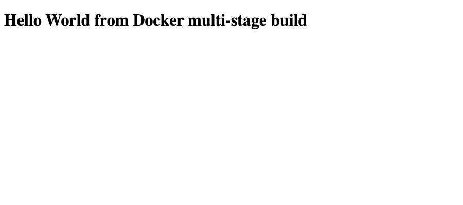
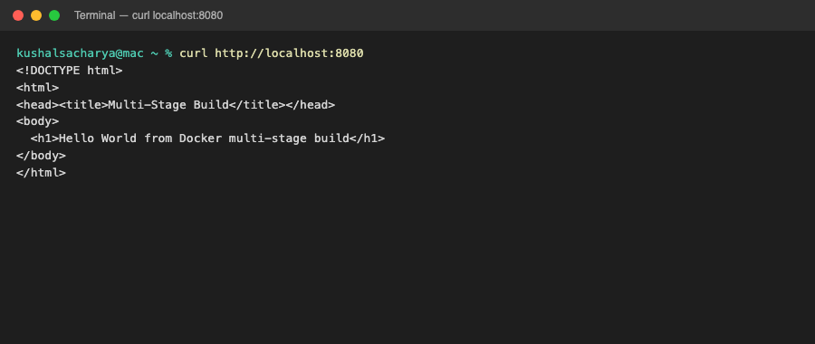
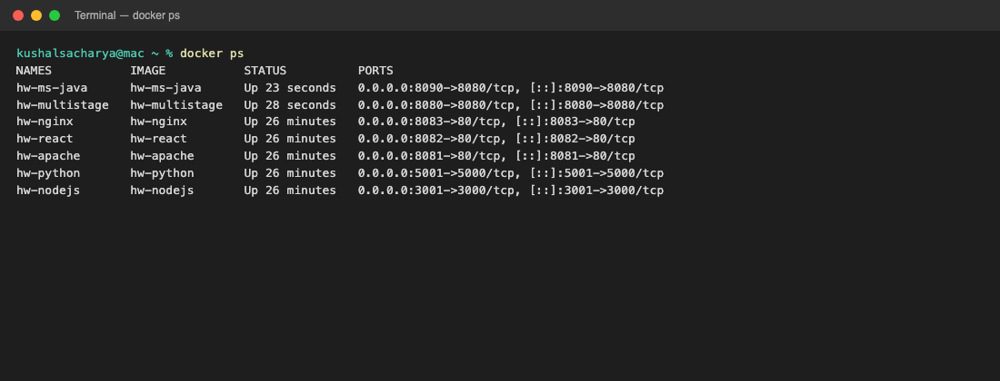

# Docker Multi-Stage Build Homework

**Name:** Kushal S  
**Enrollment number:** 24bcs10355

---

## Task 1: Run multi-stage Dockerfile

Source: devops-heros `session6-7-docker/multi-stage-dockerfile` (Node builder + production stages). App text and port set to match this assignment.

### Build and run

```bash
docker build -t hw-multistage "./multi-stage-app"
docker run -d --name hw-multistage -p 8080:8080 hw-multistage
```

### Application on port 8080

`curl http://localhost:8080` returns:

```html
<h1>Hello World from Docker multi-stage build</h1>
```

Webpage:



curl output:



### `docker ps` — container on 8080

`hw-multistage` is up with `0.0.0.0:8080->8080/tcp`.



---

## Task 2: Student details and evidence

- Name: **Kushal S**
- Enrollment number: **24bcs10355**
- App screenshot: `screenshots/app-running.png`
- docker ps screenshot: `screenshots/docker-ps.png`

---

## Task 3: Three application types on Docker

| Type | Folder | Container | URL |
|---|---|---|---|
| Node.js | `nodejs-app` | `hw-nodejs` | http://localhost:3001 |
| Python | `python-app` | `hw-python` | http://localhost:5001 |
| Java | `java-app` | `hw-ms-java` | http://localhost:8090 |

```text
NAMES           IMAGE           PORTS
hw-multistage   hw-multistage   0.0.0.0:8080->8080/tcp
hw-nodejs       hw-nodejs       0.0.0.0:3001->3000/tcp
hw-python       hw-python       0.0.0.0:5001->5000/tcp
hw-ms-java      hw-ms-java      0.0.0.0:8090->8080/tcp
```
