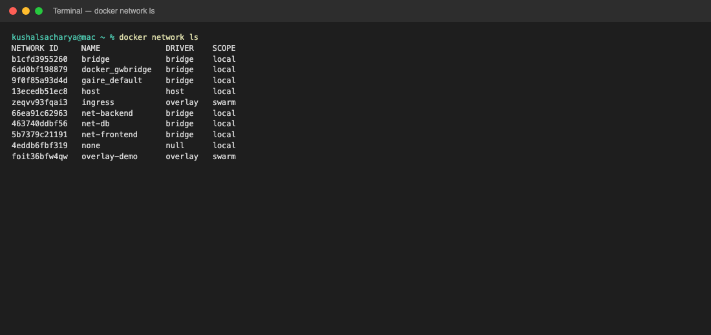
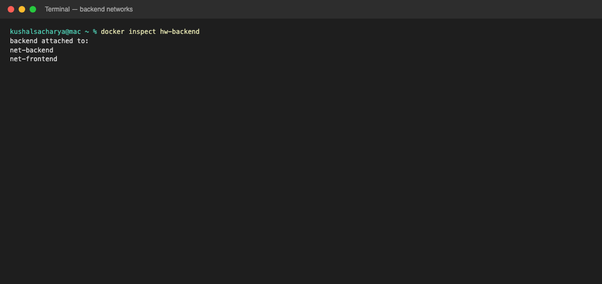
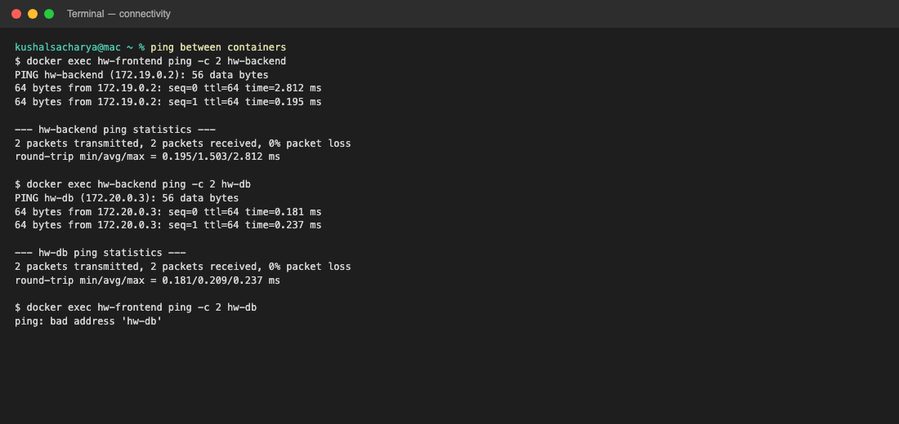
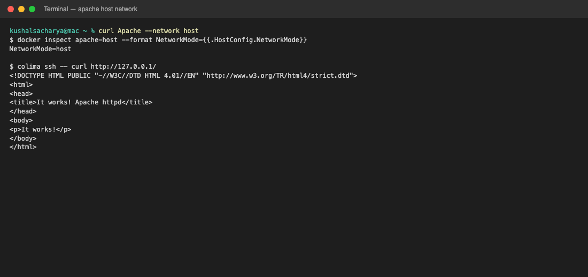
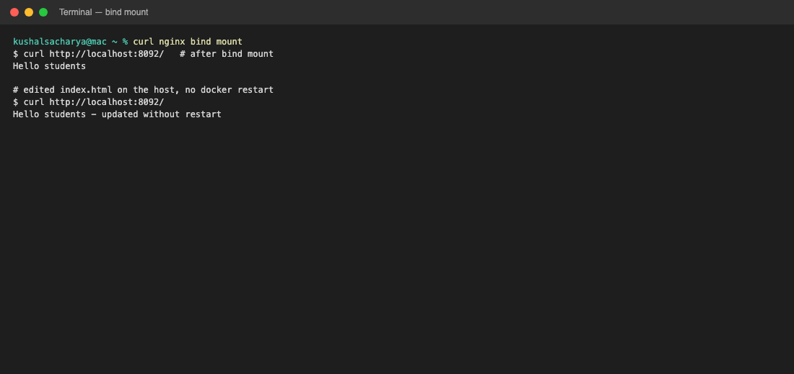
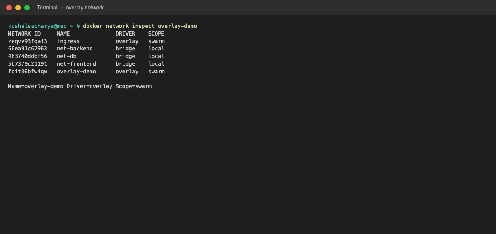
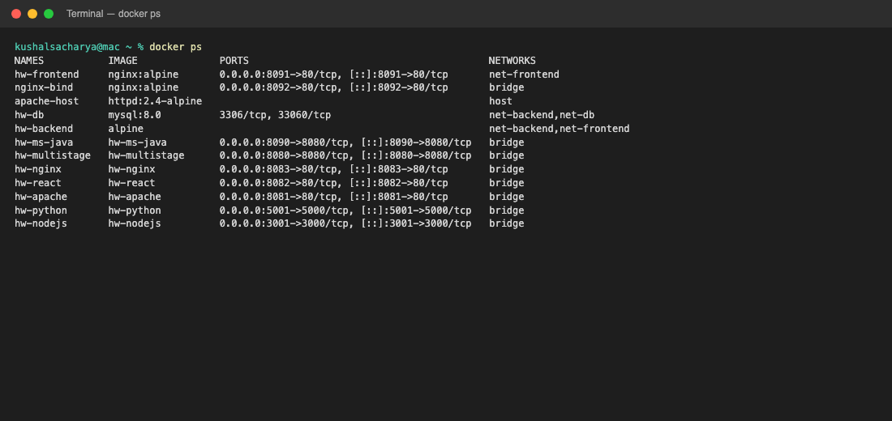

# Docker Networking & Volume Homework

**Name:** Kushal S  
**Enrollment number:** 24bcs10355

---

## Task 1: Container networking

Three custom bridge networks:

- `net-frontend`
- `net-backend`
- `net-db`

Three containers:

| Container | Image | Networks |
|---|---|---|
| `hw-frontend` | nginx:alpine | `net-frontend` |
| `hw-backend` | alpine | `net-frontend` **and** `net-backend` |
| `hw-db` | mysql:8.0 | `net-backend` and `net-db` |

```bash
docker network create net-frontend
docker network create net-backend
docker network create net-db

docker run -d --name hw-frontend --network net-frontend -p 8091:80 nginx:alpine
docker run -d --name hw-backend --network net-frontend alpine sleep 3600
docker network connect net-backend hw-backend

docker run -d --name hw-db --network net-backend \
  -e MYSQL_ROOT_PASSWORD=root -e MYSQL_DATABASE=demo mysql:8.0
docker network connect net-db hw-db
```

Networks:



Backend on **two** networks:



Connectivity:

- frontend → backend: **works** (same `net-frontend`)
- backend → database: **works** (same `net-backend`)
- frontend → database: **fails** (`hw-db` is not on `net-frontend`)



Frontend page (http://localhost:8091):


---

## Task 2: Host network (Apache)

```bash
docker pull httpd:2.4-alpine
docker run -d --name apache-host --network host httpd:2.4-alpine
```

`NetworkMode=host`. On Colima, host is the Linux VM, so Apache was checked with:

```bash
colima ssh -- curl http://127.0.0.1/
```

It returned **It works!** (default Apache page).



---

## Task 3: Bind mount

Folder: `bind-html/index.html`

```bash
echo "Hello students" > bind-html/index.html
docker run -d --name nginx-bind -p 8092:80 \
  -v "$(pwd)/bind-html:/usr/share/nginx/html" nginx:alpine
```

First curl: `Hello students`  
Then the file was edited on the host **without restarting** the container.  
Second curl: `Hello students - updated without restart`



http://localhost:8092 after the edit:


The bind mount maps the host folder into the container, so host file changes show up immediately.

---

## Task 4: Overlay network

An **overlay** network spans **more than one Docker host**. Bridge networks are local to one engine. Overlay is for Swarm/Kubernetes-style clusters.

How it works:

1. Enable Swarm (`docker swarm init`) or an orchestrator.
2. `docker network create -d overlay overlay-demo`
3. Docker uses VXLAN so containers on different machines get IPs on the same virtual network and can reach each other by name.
4. Control plane shares network state between managers/workers. Data plane encapsulates Ethernet frames over the underlay (the real IPs of the hosts).

Use cases: multi-host microservices, Swarm services that must talk across nodes, isolating east-west traffic from the public publish ports.

Created on this machine (single-node Swarm):

```text
overlay-demo    overlay    swarm
ingress         overlay    swarm
Name=overlay-demo Driver=overlay Scope=swarm
```



On one laptop this only proves the driver exists. Real overlay value is **two or more Docker hosts** joined to the same Swarm.

---

## docker ps


