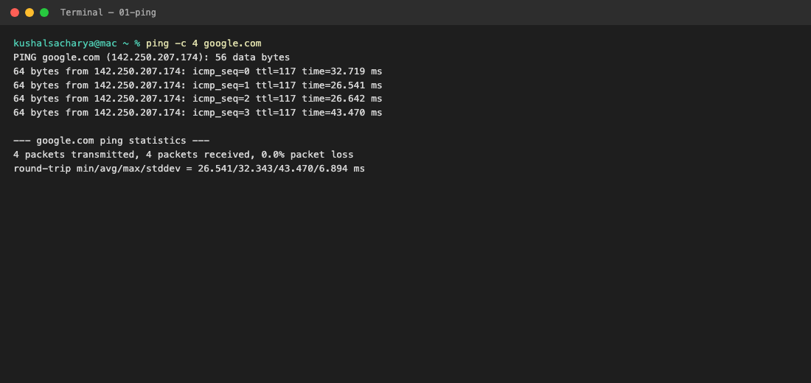
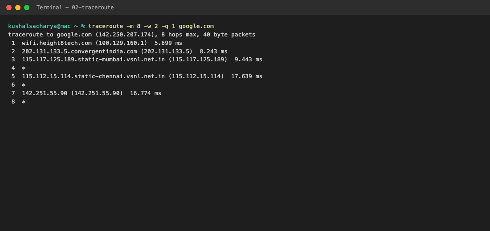
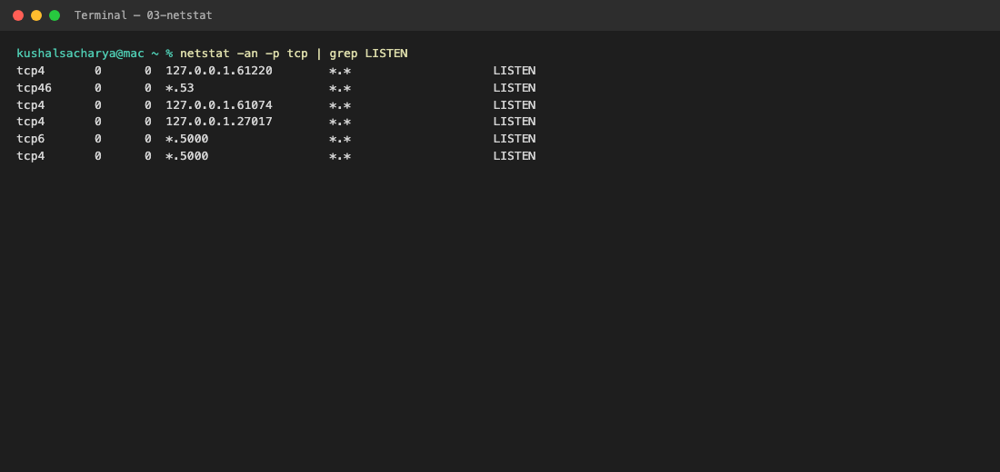
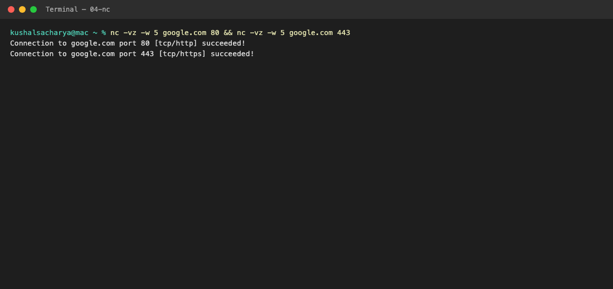
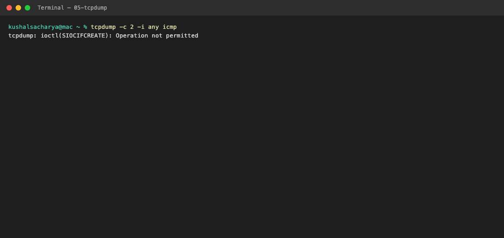
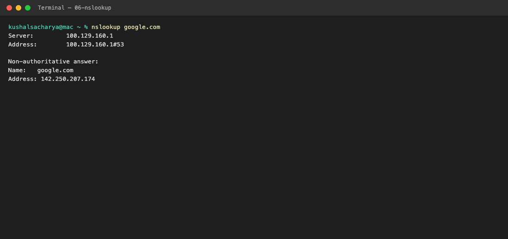
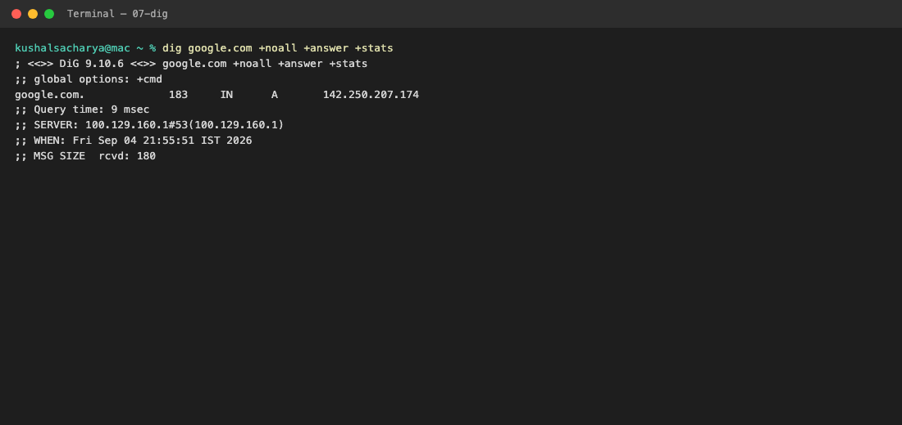
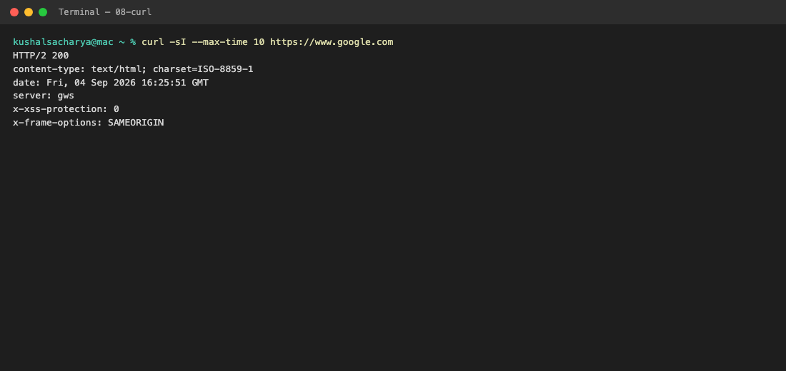
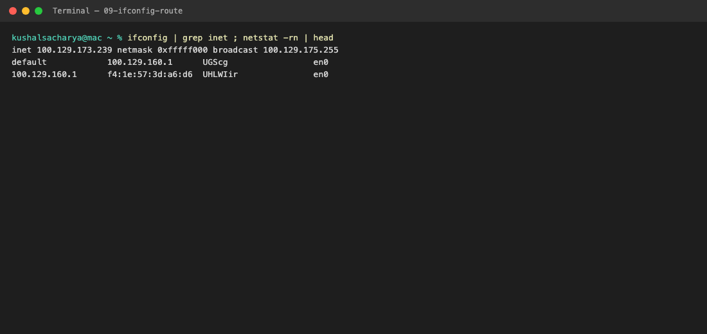
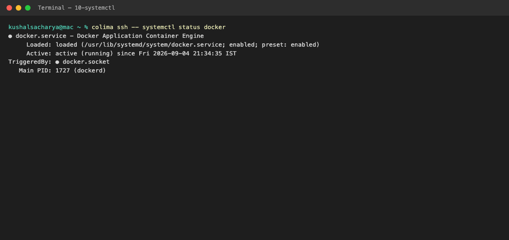

# Networking Fundamentals Homework

Practiced the commands and GitHub repos from devops-heros (`session4-networking`).

## Task 1 — Repos from devops-heros

Course list: [networking repos](https://github.com/stars/Nency-Ravaliya/lists/networking)

| Repo | What I learned |
|---|---|
| [Network-Troubleshooting](https://github.com/Nency-Ravaliya/Network-Troubleshooting) | Commands to debug google.com: ping, traceroute, netstat, telnet, tcpdump, nslookup, dig, curl, arp, systemctl |
| [OSI-Network-devices](https://github.com/Nency-Ravaliya/OSI-Network-devices) | OSI layers: cable/Wi-Fi (L1), switch/MAC (L2), router/IP (L3), ports/TCP (L4), HTTP/DNS (L7) |
| [Networking](https://github.com/Nency-Ravaliya/Networking) | DHCP (discover → offer → request → ack), then browser traffic goes laptop → switch → router → hops → google.com |
| [Subnetting](https://github.com/Nency-Ravaliya/Subnetting) | Subnet mask splits network vs host bits. `/24` = 255.255.255.0 |
| [How-DHCP-Works](https://github.com/Nency-Ravaliya/How-DHCP-Works) | DHCP assigns IP, mask, gateway, DNS |
| [IP-quest](https://github.com/Nency-Ravaliya/IP-quest) | IP addressing practice |
| [IPFIX-NETFLOW-NTP](https://github.com/Nency-Ravaliya/IPFIX-NETFLOW-NTP) | Flow export and time sync (NTP) |

From `session4-networking/ip.md`: an IP identifies a device. Class A 1–127, B 128–191, C 192–223. Private range example: `10.0.0.0`–`10.255.255.255`. Usable hosts = `2^(host bits) - 2`.

---

## Task 2 — Commands, output, and what I understood

Ran on macOS (Colima Ubuntu used for `ss` and `systemctl`). `telnet` is not installed here, so `nc` was used for port checks.

### 1. `ping` — is the host reachable?

```bash
ping -c 4 google.com
```



**Understood:** ICMP echo. DNS worked (`google.com` → `142.250.207.174`), path is up, 0% loss, ~32 ms RTT.

---

### 2. `traceroute` — which hops are on the path?

```bash
traceroute -m 8 -w 2 -q 1 google.com
```



**Understood:** Each hop is a router (Layer 3). `*` means that hop did not reply (often ICMP filtered). Traffic left my Wi-Fi gateway, then ISP (Mumbai/Chennai), then Google.

---

### 3. `netstat` — what is listening locally?

Linux form from the repo: `netstat -tuln`. On this Mac:

```bash
netstat -an -p tcp | grep LISTEN
```



On Colima Ubuntu: `ss -tuln` showed SSH on port 22 and DNS on port 53.

**Understood:** Shows local sockets. `LISTEN` means a service is waiting. `127.0.0.1` is only this machine. `0.0.0.0` / `*` is all interfaces. Port 22 = SSH, 53 = DNS.

---

### 4. `telnet` / `nc` — can I reach a port?

`telnet google.com 80` — `telnet` not installed. Used:

```bash
nc -vz -w 5 google.com 80
nc -vz -w 5 google.com 443
```



**Understood:** Ping only tests ICMP. This tests TCP to a real service port (80 HTTP, 443 HTTPS). Success means the path and firewall allow that port.

---

### 5. `tcpdump` — capture packets

```bash
sudo tcpdump -i eth0 host google.com
```

On this Mac (no sudo):



**Understood:** Packet sniffer (Layer 2/3). Needs root because it reads raw frames. Use it when ping/curl fail and you need to see if packets actually leave the NIC.

---

### 6. `nslookup` — DNS name → IP

```bash
nslookup google.com
```



**Understood:** Asks DNS (port 53) for an A record. `#53` is the DNS port. Non-authoritative means a recursive resolver answered, not Google’s own DNS.

---

### 7. `dig` — more detail than nslookup

```bash
dig google.com
```



**Understood:** Same job as nslookup, more fields. `183` is TTL (seconds the record may be cached). Fast query (9 ms) means DNS is healthy.

---

### 8. `curl` — HTTP/HTTPS to the site

```bash
curl -I https://www.google.com
```



**Understood:** `-I` fetches headers only. `HTTP/2 200` means HTTPS to Google worked (TCP + TLS + HTTP). If ping works but curl fails, the problem is often firewall/proxy on 443, not basic routing.

---

### 9. `arp` — IP → MAC on the LAN

```bash
arp -a
```

`arp -a` was slow, then printed the LAN neighbor table. Gateway entry:

```text
wifi.height8tech.com (100.129.160.1) at f4:1e:57:3d:a6:d6 on en0 ifscope [ethernet]
```

My IP and the same gateway MAC from `ifconfig` / `netstat -rn`:



**Understood:** ARP is Layer 2. You only ARP for hosts on your local subnet (here the Wi-Fi gateway). You never ARP for google.com itself — that IP is off-LAN, so the frame goes to the gateway MAC.

---

### 10. `systemctl` — is the network service up?

Not on macOS. On Colima Ubuntu:

```bash
systemctl status docker
```



**Understood:** `systemctl` manages systemd units. If NetworkManager/docker/sshd is `inactive` or `failed`, apps will look like “network is down” even when the cable is fine.

---

## How I would use these in order

1. `ping` — L3 reachability  
2. `nslookup` / `dig` — name resolution  
3. `traceroute` — where the path breaks  
4. `nc` / `curl` — application port / HTTP  
5. `netstat` / `ss` — local listeners  
6. `arp` / `ifconfig` — local LAN / gateway  
7. `tcpdump` — packets on the wire  
8. `systemctl` — local service health  

If ping fails, check cable, Wi-Fi, IP, gateway. If ping works but the browser fails, check DNS, then port 443, then HTTP.
