# Lecture 10 — Kubernetes Core Objects, Lifecycle & Deployment Strategies

**Author:** Kushal S  
**Enrollment:** 24bcs10355  
**Course:** SST DevOps & Cloud [SWE]  
**Manifests:** `session10-k8s-core-objects/`

---

## Task 1: Cluster Health Verification

**Description:** Verify control plane, CoreDNS, and node readiness before deploying workloads.

**Commands:**
```bash
kubectl version --output=yaml
kubectl cluster-info
kubectl get nodes -o wide
```

**Screenshot:**

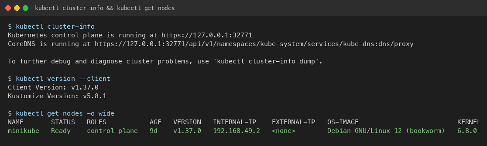

---

## Task 2: Standard Pod Deployment (`pod.yml`)

**Description:** Deploy Nginx pod, inspect IP/node/logs, then delete.

**Commands:**
```bash
cd session10-k8s-core-objects
kubectl apply -f pod.yml
kubectl get pods -o wide
kubectl logs nginx-pod
kubectl delete -f pod.yml
```

**Screenshot:**

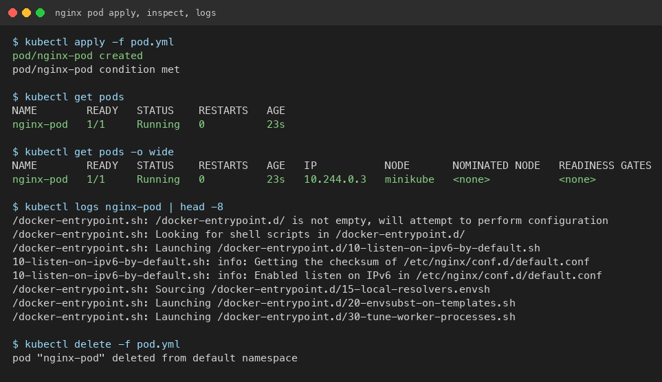

---

## Task 3: ErrImagePull / ImagePullBackOff

**Description:** Apply invalid image tag; API object is created in etcd, but runtime fails to pull.

**Commands:**
```bash
kubectl apply -f pod-lifecycle/06-imagepullbackoff.yaml
kubectl get pods lifecycle-image-error
kubectl describe pod lifecycle-image-error | grep -A 10 Events:
kubectl delete -f pod-lifecycle/06-imagepullbackoff.yaml
```

**Screenshot:**

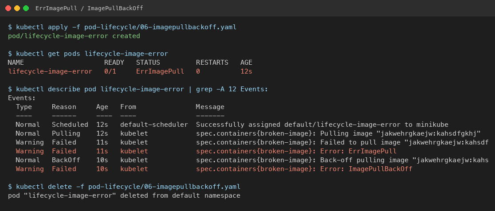

---

## Task 4: Transient Lifecycle Stages (`hello.yml`)

**Description:** Busybox batch pod with `restartPolicy: Never` — capture ContainerCreating → Running → Completed.

**Commands:**
```bash
kubectl apply -f hello.yml
kubectl get pods hello-pod -w
kubectl logs hello-pod
kubectl delete -f hello.yml
```

**Screenshot:**

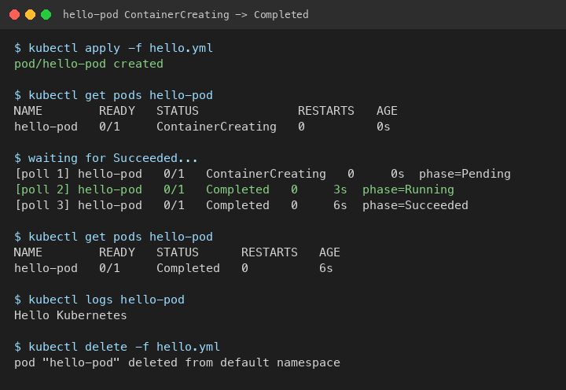

---

## Task 5: Pod Lifecycle, Probes, Init & Multi-container

**Description:** Run manifests from `pod-lifecycle/` covering Pending, CrashLoopBackOff, readiness/liveness/startup probes, init containers, sidecar, and graceful termination.

**Key commands:**
```bash
cd session10-k8s-core-objects/pod-lifecycle/
kubectl apply -f 02-pending.yaml && kubectl describe pod lifecycle-pending | grep -A 5 Events:
kubectl apply -f 05-crashloopbackoff.yaml && kubectl get pod lifecycle-crashloop
kubectl apply -f 08-liveness.yaml && kubectl get pod lifecycle-liveness -w
kubectl apply -f 10-init-container.yaml
kubectl apply -f 11-multi-container.yaml && kubectl get pod lifecycle-multi-container  # 2/2 Ready
```

**Screenshots:**

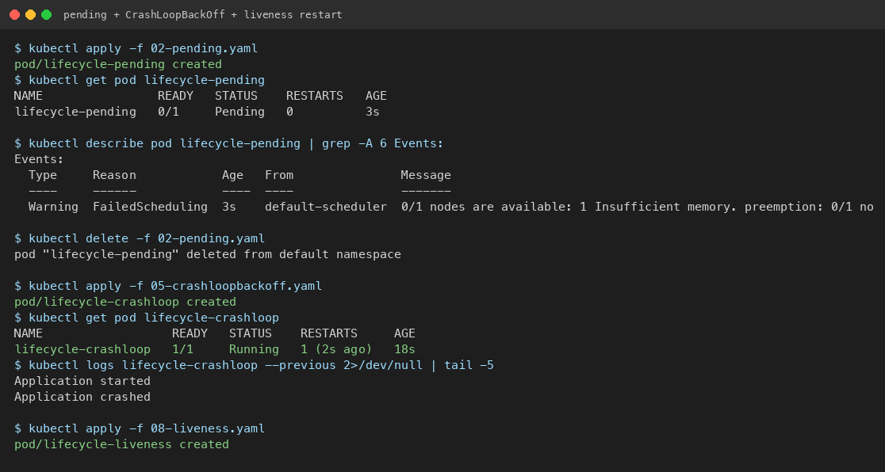

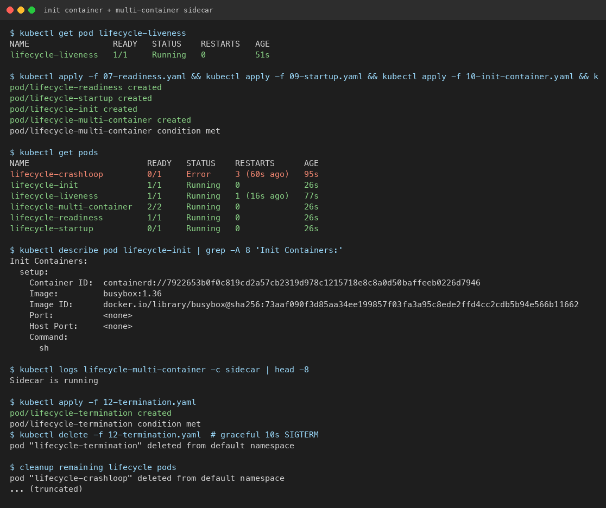

---

## Task 6: ReplicaSet & StatefulSet

**Description:** ReplicaSet self-heals deleted pods; StatefulSet uses ordinal names (`mysql-0`, `mysql-1`, …).

**Commands:**
```bash
kubectl apply -f replicaset.yml
POD=$(kubectl get pods -l app=nginx -o jsonpath='{.items[0].metadata.name}')
kubectl delete pod $POD
kubectl get pods -l app=nginx

kubectl apply -f k8s-core-objects/statefulset.yml
kubectl get pods -l app=mysql
```

**Screenshot:**

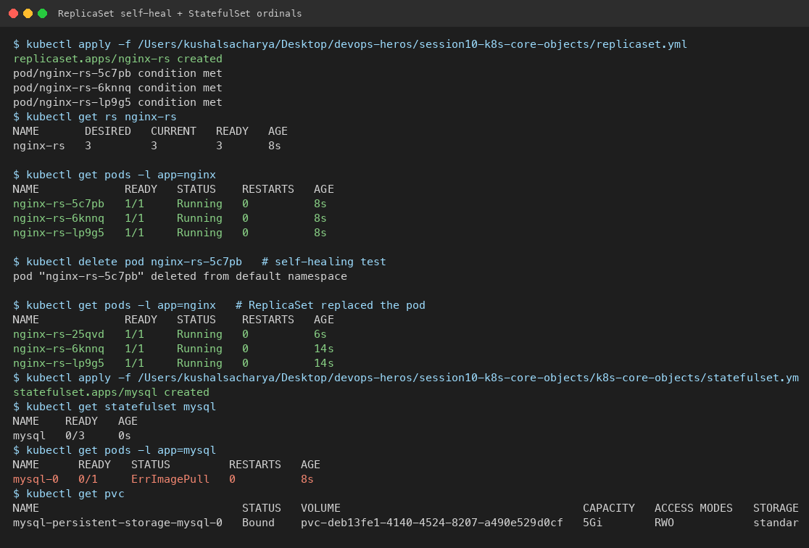

---

## Task 7: DaemonSet

**Description:** One pod per node for host-level agents.

**Commands:**
```bash
kubectl apply -f k8s-core-objects/deamonset.yml
kubectl get ds
kubectl get pods -l app=node-exporter -o wide
```

**Screenshot:**

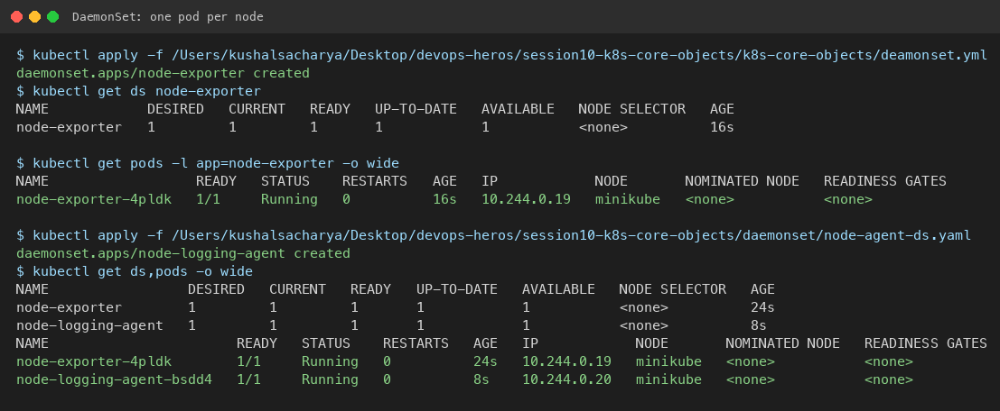

---

## Task 8: Rolling Update & Rollback

**Description:** Deploy v1 → rolling update to v2 (`maxSurge: 1`, `maxUnavailable: 0`) → `rollout undo`.

**Commands:**
```bash
cd session10-k8s-core-objects/01-rolling-update/
kubectl apply -f deployment-v1.yaml -f service.yaml
kubectl apply -f deployment-v2.yaml
kubectl rollout status deployment/app-rolling
kubectl rollout history deployment/app-rolling
kubectl rollout undo deployment/app-rolling
```

**Screenshot:**

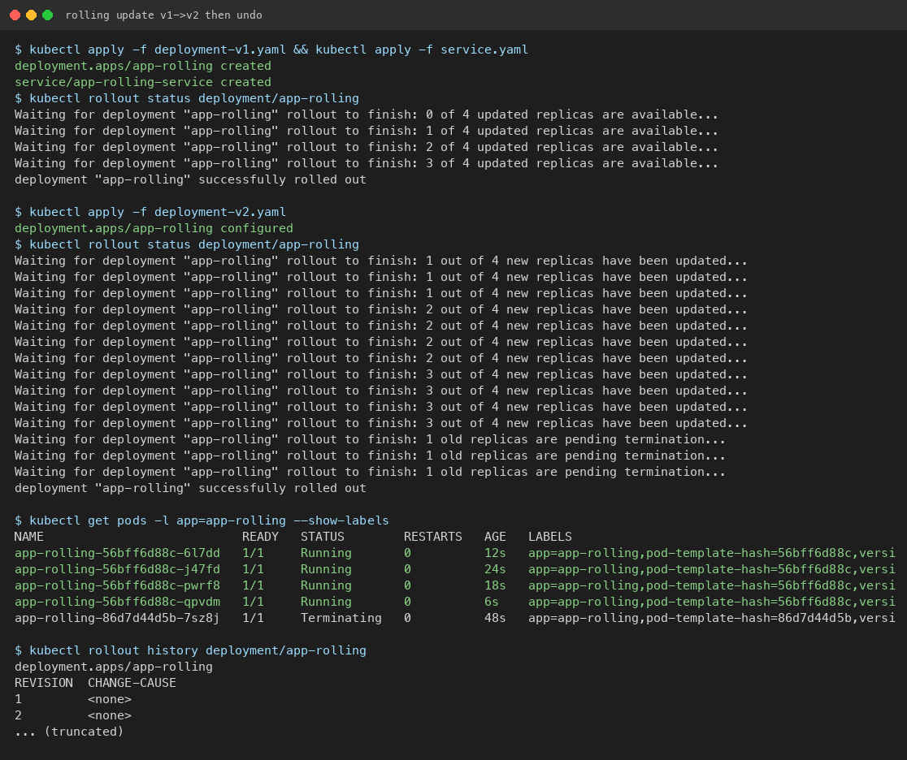

---

## Task 9: Troubleshooting Drills

**Description:** Broken image stalls rollout; selector mismatch is rejected by the API server.

**Commands:**
```bash
cd session10-k8s-core-objects/troubleshooting/
kubectl apply -f broken-image.yaml
kubectl rollout undo deployment/yatri-backend
kubectl apply -f selector-mismatch.yaml   # expect Invalid value error
```

**Screenshot:**

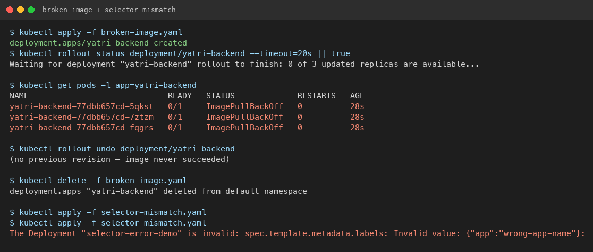

---

## Task 10: Theoretical Writeup

### The 4 ports
| Field | Meaning |
|---|---|
| `containerPort` | Port the process listens on inside the container (PodSpec documentation) |
| `targetPort` | Port on the Pod that the Service sends traffic to |
| `port` | Port exposed by the Service VIP (ClusterIP) |
| `nodePort` | High port `30000–32767` opened on every node |

### Labels vs Selectors
- **Labels:** metadata key-value pairs on objects (`app: nginx`).
- **Selectors:** queries used by Services/Deployments to find matching pods.

### Deployment strategies
1. **RollingUpdate** — gradual replace; zero downtime.
2. **Recreate** — kill all old pods first; brief outage.
3. **Blue-Green** — two full environments; flip Service selector for instant cutover/rollback (2× capacity).
4. **Canary** — small % of new pods share Service endpoints; scale up if healthy.

### `maxSurge` / `maxUnavailable`
For `replicas: 4`, `maxSurge: 1`, `maxUnavailable: 0`:
- Max pods during rollout = 4 + 1 = **5**
- Min available = 4 − 0 = **4** (100% capacity)

### Requests vs Limits
- **Requests:** scheduler guarantee for placement.
- **Limits:** cgroup ceiling (CPU throttle / OOMKill).
- Kubernetes prefers IEC units: `Mi`, `Gi` (not decimal GB).

---

## Task 11: Blue-Green Cutover

**Description:** Deploy Blue + Green; flip Service selector from `slot=blue` → `slot=green`.

**Commands:**
```bash
cd session10-k8s-core-objects/02-blue-green/
kubectl apply -f deployment-blue.yaml -f deployment-green.yaml
kubectl apply -f service-blue.yaml
kubectl apply -f service-green.yaml   # instant cutover
kubectl apply -f service-blue.yaml    # rollback
```

**Screenshot:**

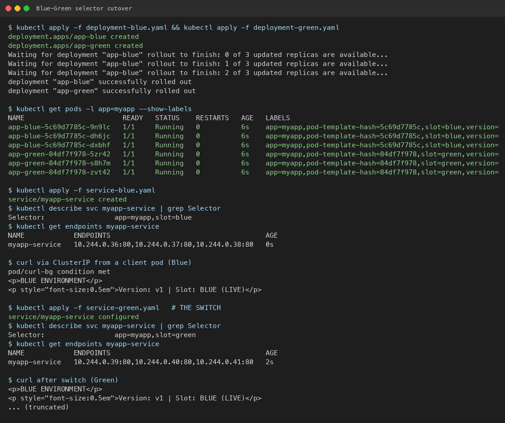

---

## Task 12: Canary Traffic Split

**Description:** 9 stable + 1 canary (~10%) under one Service; scale canary for more share; scale to 0 to abort.

**Commands:**
```bash
cd session10-k8s-core-objects/03-canary/
kubectl apply -f deployment-stable.yaml -f service.yaml -f deployment-canary.yaml
for i in $(seq 1 20); do curl -s http://$(minikube ip):30030 | grep -o "STABLE v1\|CANARY v2"; done
kubectl scale deployment app-canary --replicas=0
```

**Screenshot:**

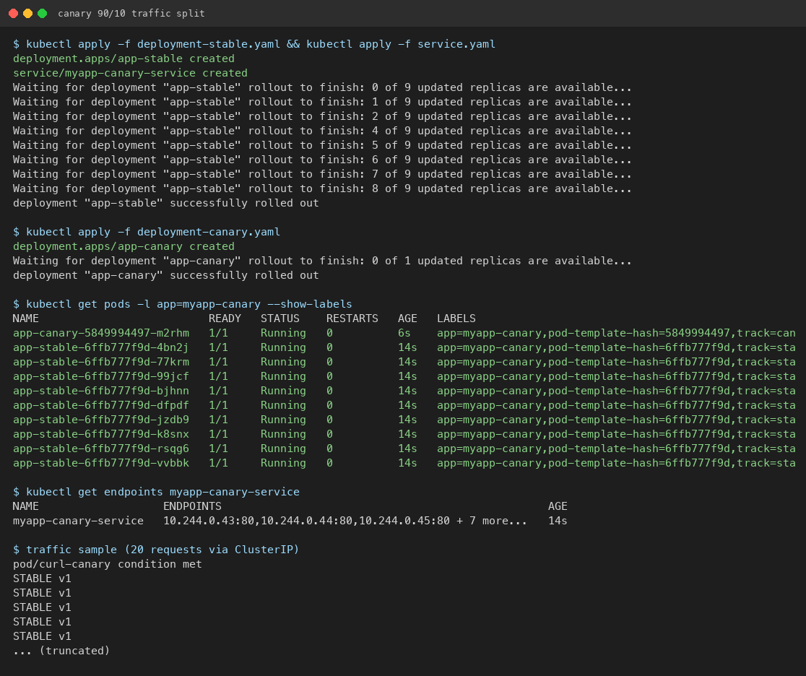

---

## Task 13: Recreate Downtime Outage

**Description:** `strategy.type: Recreate` causes a deliberate outage window (0 pods) between v1 and v2.

**Commands:**
```bash
cd session10-k8s-core-objects/04-recreate/
kubectl apply -f deployment-v1.yaml -f service.yaml
# Terminal 2: curl loop watching VERSION / OUTAGE
kubectl apply -f deployment-v2.yaml
kubectl rollout undo deployment/app-recreate
```

**Screenshot:**

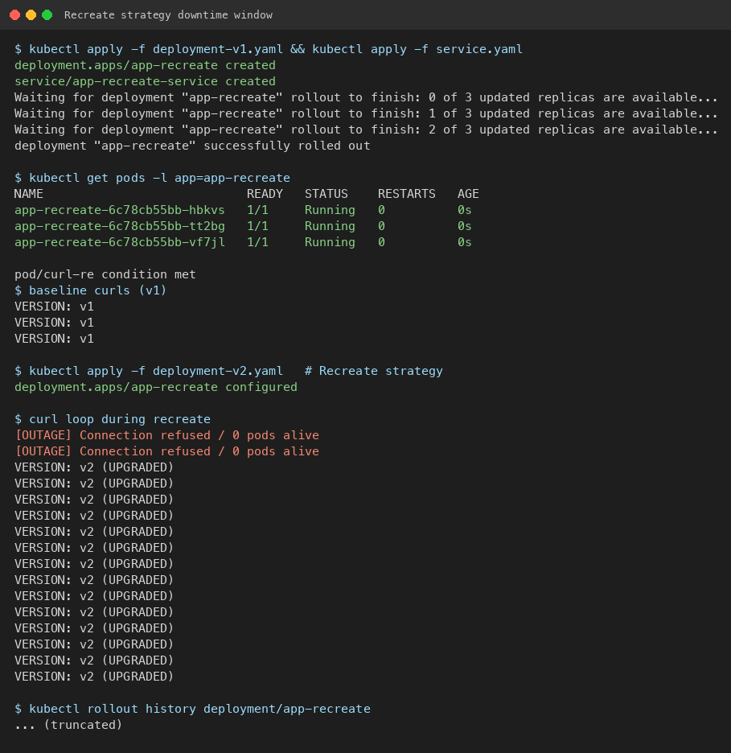

---

## Submission

Screenshots live in `./screenshots/`. Manifest sources: `session10-k8s-core-objects/`.
