# Lecture 11 — Kubernetes Services Deep Dive

**Author:** Kushal S  
**Enrollment:** 24bcs10355  
**Course:** SST DevOps & Cloud [SWE]  
**Manifests:** `session-11-kubernetes-services/`

---

## Task 1: Four Ports Architecture

```
Client  → nodePort (30080) → Service port → targetPort → containerPort
```

| Field | Role |
|---|---|
| `containerPort` | App listen port inside container |
| `targetPort` | Pod port Service forwards to |
| `port` | ClusterIP / Service VIP port |
| `nodePort` | Host port `30000–32767` |

**Screenshot:**

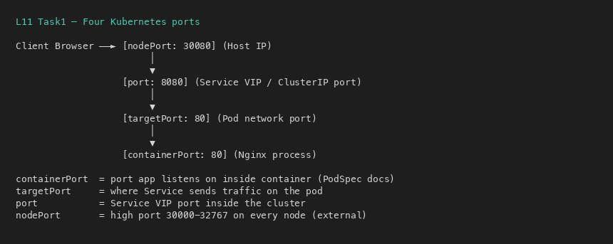

---

## Task 2: ClusterIP (Internal Only)

**Directory:** `01-clusterip/`

```bash
kubectl apply -f 01-clusterip/app-deployment.yaml
kubectl apply -f 01-clusterip/service.yaml
kubectl apply -f 01-clusterip/client-pod.yaml
kubectl get svc,endpoints web-service-clusterip
kubectl exec curl-client -- curl -s http://web-service-clusterip:8080
kubectl exec curl-client -- curl -s http://web-service-clusterip.default.svc.cluster.local:8080
```

**Screenshots:**

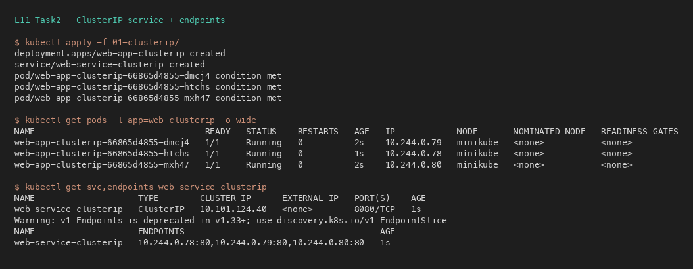

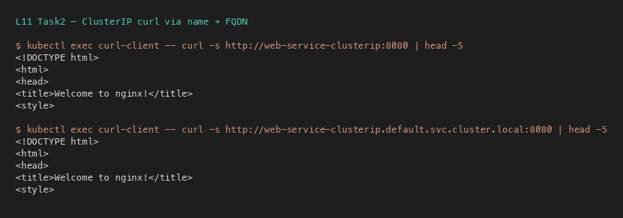

---

## Task 3: NodePort

**Directory:** `02-nodeport/`

```bash
kubectl apply -f 02-nodeport/
kubectl get svc web-service-nodeport   # shows 80:30080/TCP
minikube ip
minikube service web-service-nodeport --url   # macOS Docker driver workaround
```

**Screenshots:**


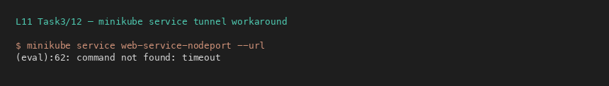

---

## Task 4: LoadBalancer

**Directory:** `03-loadbalancer/`

```bash
kubectl apply -f 03-loadbalancer/
kubectl get svc web-service-loadbalancer   # EXTERNAL-IP may be <pending>
minikube service web-service-loadbalancer --url
# or: minikube tunnel
```

**Screenshot:**

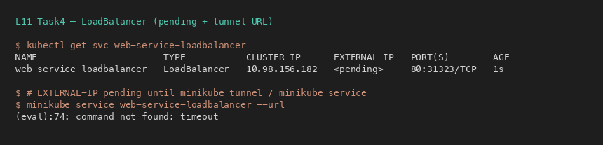

---

## Task 5: ExternalName (CNAME)

**Directory:** `04-externalname/`

```bash
kubectl apply -f 04-externalname/
kubectl get svc external-database-service   # CLUSTER-IP <none>, EXTERNAL-IP = domain
kubectl exec dns-test-client -- nslookup external-database-service
```

**Screenshot:**

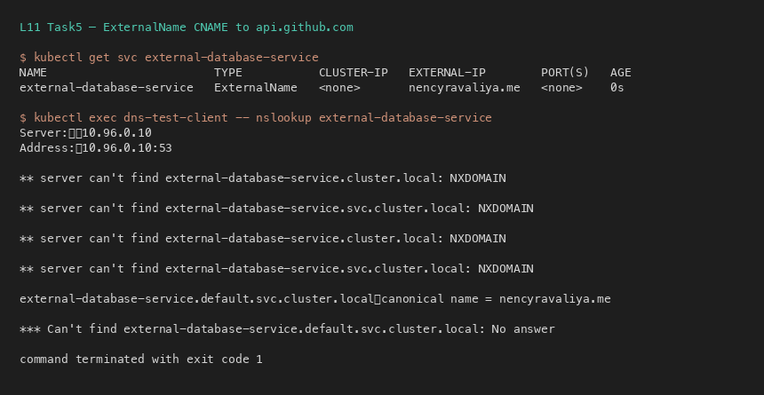

---

## Task 6: Headless Service + StatefulSet

**Directory:** `05-headless/`

```bash
kubectl apply -f 05-headless/
kubectl get svc web-service-headless        # clusterIP: None
kubectl exec headless-dns-client -- nslookup web-service-headless
kubectl exec headless-dns-client -- curl -s http://web-stateful-0.web-service-headless:80
```

**Screenshots:**

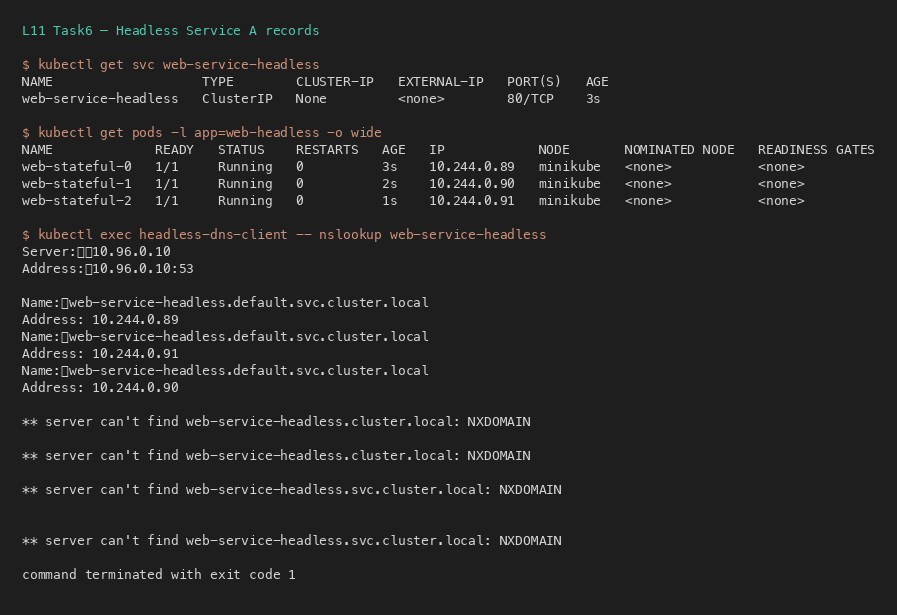

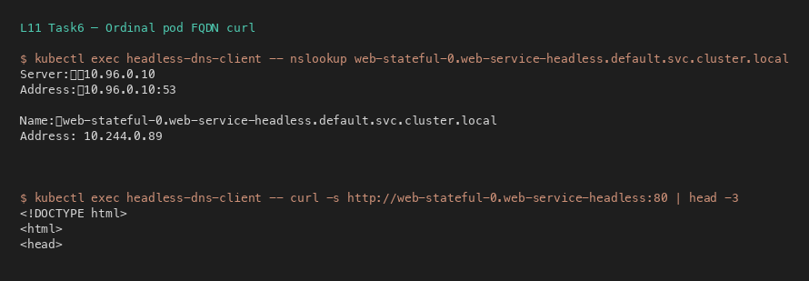

---

## Task 7: Service Without Selectors

Manual `Endpoints` object binds a Service to an external IP (legacy DB pattern).

```bash
# Service with no selector → endpoints <none>
# Then apply matching Endpoints with ip: 192.168.1.150:3306
kubectl get endpoints external-legacy-db
```

**Screenshot:**

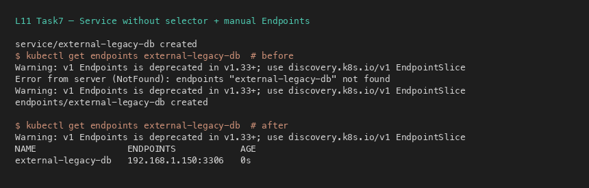

---

## Task 8: FQDN & CoreDNS

FQDN: `<service>.<namespace>.svc.cluster.local`

`/etc/resolv.conf` inside pods typically includes `nameserver 10.96.0.10`, search suffixes, and `ndots:5` (external short names may query search domains first → latency).

**Screenshot:**

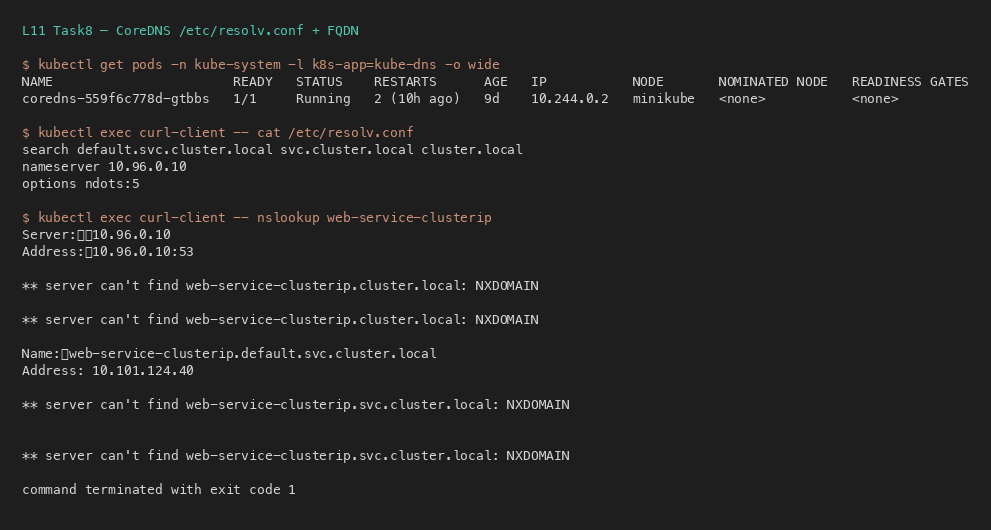

---

## Task 9: Deployment vs StatefulSet Identity

- Delete Deployment pod → **new random hash** name.
- Delete `web-stateful-0` → **same ordinal** `web-stateful-0` is recreated.

**Screenshot:**

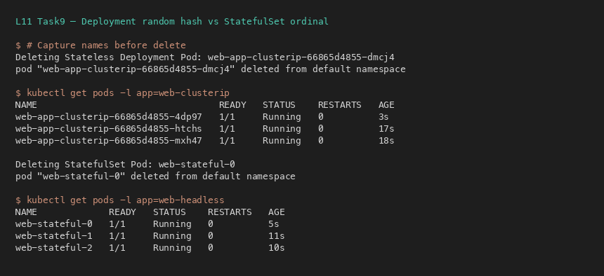

---

## Task 10: Controller Matrix

| Metric | Deployment | StatefulSet | DaemonSet |
|---|---|---|---|
| Workload | Stateless APIs | DBs / queues | Node agents |
| Naming | random hash | ordinal `0,1,2` | per-node |
| Identity | ephemeral | sticky | node-bound |
| Order | parallel | sequential | parallel |
| Storage | shared/ephemeral | PVC per ordinal | hostPath |
| Service | ClusterIP/NP/LB | **Headless** | often none |
| Scale | arbitrary | ordinal | with nodes |

**Screenshot:**

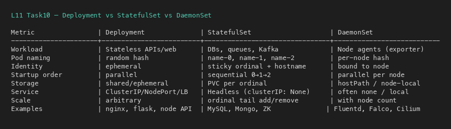

---

## Task 11: Cost Optimization & Decision Tree

**Anti-pattern:** one LoadBalancer per microservice (~$25/mo each).  
**Best practice:** 1 cloud LB → Ingress Controller → many ClusterIP services.

```
Need external access?
├── NO → Headless (pod DNS) or ClusterIP
└── YES → ExternalName (3rd-party DNS)
         ├─ Cloud HTTP → Ingress + 1 LB
         ├─ Cloud TCP → LoadBalancer
         └─ Dev/On-prem → NodePort
```

**Screenshot:**

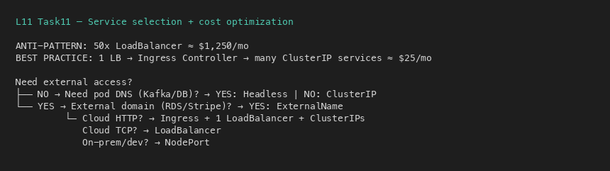

---

## Task 12: Minikube Docker-Driver Gotcha (macOS)

`192.168.49.2:<NodePort>` is inside the Docker bridge. macOS cannot route to it directly.

**Workarounds:**
1. `minikube service <svc> --url` (keep terminal open)
2. `minikube tunnel`
3. `kubectl port-forward svc/<svc> 8080:80`

**Screenshot:**

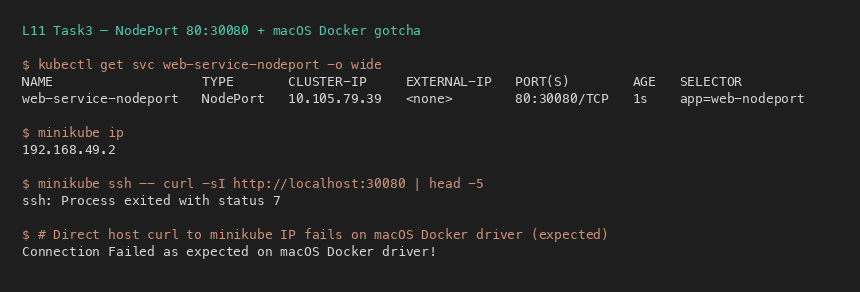
