# Lecture 12 — ConfigMaps, Secrets & Ingress

**Author:** Kushal S  
**Enrollment:** 24bcs10355  
**Course:** SST DevOps & Cloud [SWE]  
**Manifests:** `session-12-ingress-configmaps-secrets/`

> Personalized lab objects use `kushal-app-config` / `kushal-db-secret`.  
> Full-demo stack uses course names `yatri-*`.

---

## Task 1: ConfigMap (Non-sensitive Config)

```bash
kubectl apply -f 01-configmap/app-config.yaml
kubectl describe configmap kushal-app-config
kubectl get configmap kushal-app-config -o jsonpath='{.data.ENVIRONMENT}'
```

**Screenshot:**

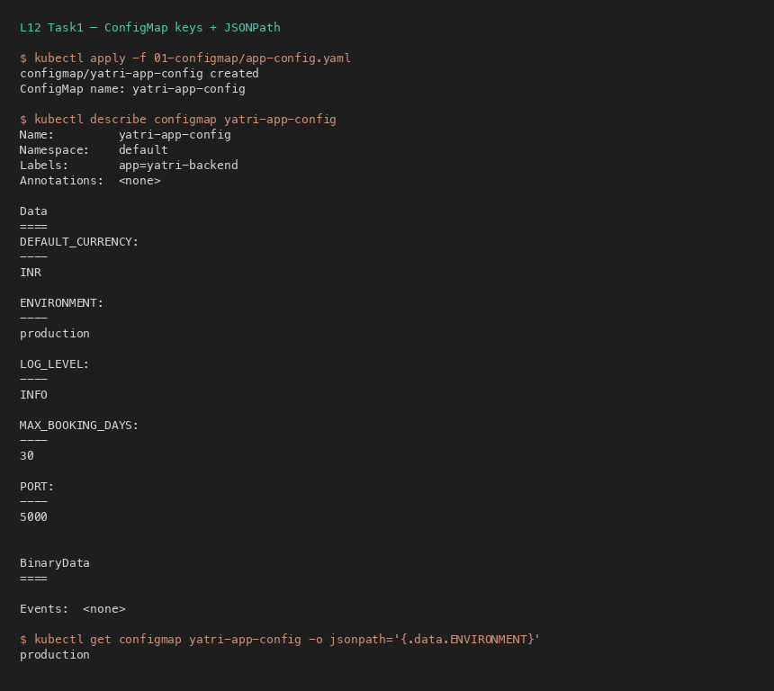

---

## Task 2: ConfigMap Live Update Needs Restart

Patching a ConfigMap does **not** update env vars in already-running containers. Use `kubectl rollout restart`.

```bash
kubectl patch configmap yatri-app-config --type merge -p '{"data":{"ENVIRONMENT":"staging"}}'
kubectl exec deploy/yatri-backend -- printenv ENVIRONMENT   # still old
kubectl rollout restart deployment/yatri-backend
kubectl exec deploy/yatri-backend -- printenv ENVIRONMENT   # staging
```

**Screenshot:**

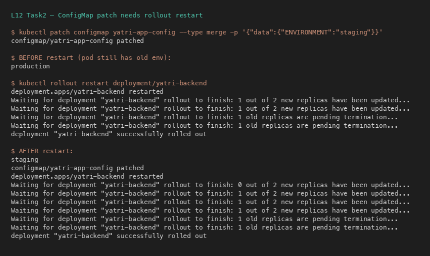

---

## Task 3: Secrets & Base64

Base64 is **encoding**, not encryption. `kubectl describe secret` masks values.

```bash
kubectl apply -f 02-secret/db-secret.yaml
kubectl describe secret kushal-db-secret
kubectl get secret kushal-db-secret -o jsonpath='{.data.POSTGRES_PASSWORD}' | base64 --decode
```

**Screenshot:**

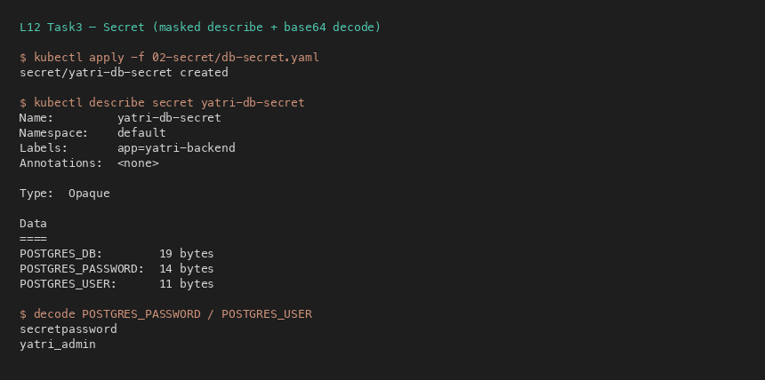

---

## Task 4: Trailing Newline Gotcha

```bash
echo "secretpassword" | base64      # WRONG — appends 0x0A → ...cmQK
echo -n "secretpassword" | base64   # RIGHT → ...cmQ=
```

**Screenshot:**

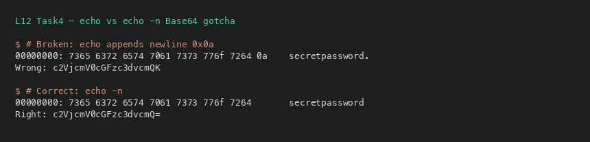

---

## Task 5: Enterprise Secret Management

Do **not** commit Secret YAMLs to Git long-term.

```
AWS Secrets Manager / Vault / Azure Key Vault
        → External Secrets Operator / Vault Agent
        → ephemeral K8s Secret
        → Pod env / volume
```

CI/CD (GitHub Actions secrets / ADO Variable Groups) injects at deploy time.

**Screenshot:**

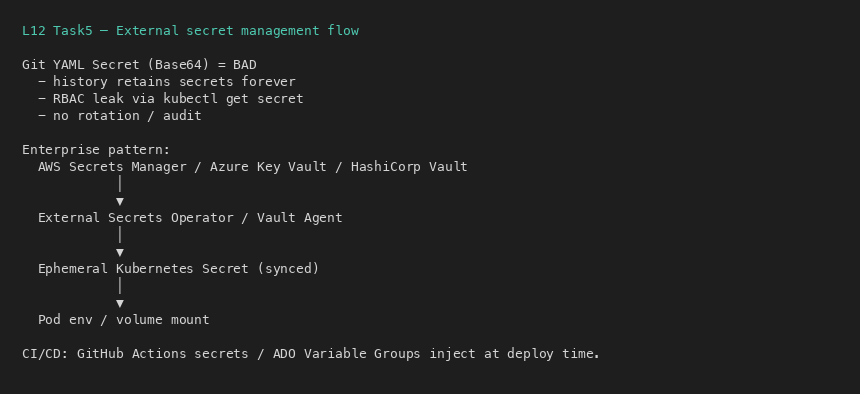

---

## Task 6: Combined Injection

Backend uses `envFrom.configMapRef` + `secretKeyRef`.

```bash
kubectl apply -f 04-full-demo/configmap.yaml -f 04-full-demo/secret.yaml -f 04-full-demo/backend.yaml
kubectl exec deploy/yatri-backend -- env | grep -E 'ENVIRONMENT|POSTGRES'
```

**Screenshot:**

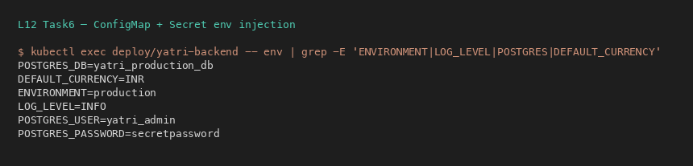

---

## Task 7: Ingress Resource vs Controller

| Ingress Resource | Ingress Controller |
|---|---|
| YAML rules (hosts/paths/TLS) | Running reverse proxy (NGINX) |
| Does nothing alone | Watches API, rewrites nginx.conf, routes traffic |

**Screenshot:**

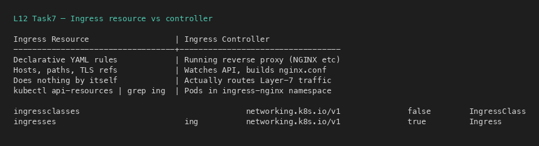

---

## Task 8: Enable NGINX Ingress on Minikube

```bash
minikube addons enable ingress
kubectl wait -n ingress-nginx --for=condition=ready pod \
  -l app.kubernetes.io/component=controller --timeout=180s
kubectl get pods -n ingress-nginx
```

**Screenshot:**

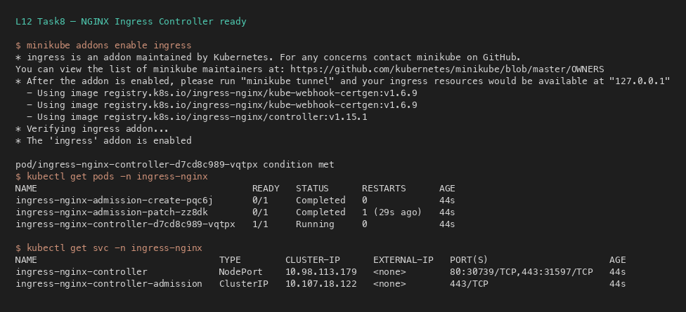

---

## Task 9: `/etc/hosts` Mapping

```bash
MINIKUBE_IP=$(minikube ip)
echo "${MINIKUBE_IP}  yatri.local portal.campus.local api.campus.local" | sudo tee -a /etc/hosts
```

On macOS Docker driver, prefer `curl --resolve` / Host header if direct IP routing fails.

**Screenshot:**

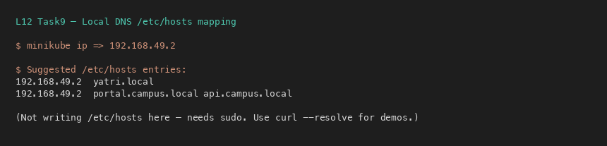

---

## Task 10: Path-Based Routing

`yatri.local/` → frontend, `yatri.local/api/` → backend (with rewrite annotations).

```bash
kubectl apply -f 04-full-demo/frontend.yaml -f 04-full-demo/backend.yaml -f 04-full-demo/ingress.yaml
curl --resolve yatri.local:80:$(minikube ip) http://yatri.local/
curl --resolve yatri.local:80:$(minikube ip) http://yatri.local/api/
```

**Screenshot:**

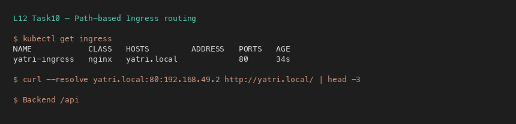

---

## Task 11: Host-Based Routing

`portal.campus.local` vs `api.campus.local` on the same entry IP.

```bash
curl -H "Host: portal.campus.local" http://$(minikube ip)/
curl -H "Host: api.campus.local" http://$(minikube ip)/api/
```

**Screenshot:**


---

## Task 12: Hybrid Ingress

`03-ingress/ingress-tls.yaml` combines hosts + paths.

```bash
kubectl apply -f 03-ingress/ingress-tls.yaml
kubectl describe ingress campus-ingress-tls
```

**Screenshot:**

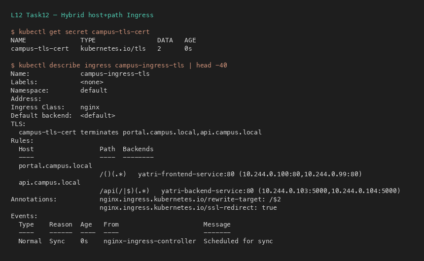

---

## Task 13: TLS Termination

```bash
openssl req -x509 -nodes -days 365 -newkey rsa:2048 \
  -keyout tls.key -out tls.crt -subj "/CN=campus.local/O=CampusDevOps"
kubectl create secret tls campus-tls-cert --cert=tls.crt --key=tls.key
curl -k -v --resolve portal.campus.local:443:$(minikube ip) https://portal.campus.local/
```

**Screenshot:**

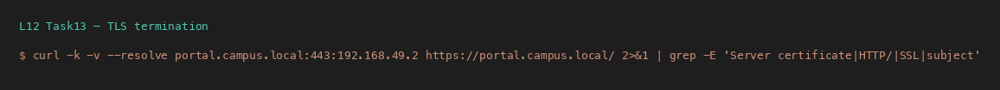

---

## Task 14: Full Demo Automation

```bash
cd 04-full-demo
bash run-demo.sh
kubectl get configmap,secret,ingress,deploy,svc,pods
bash cleanup.sh
```

**Screenshots:**

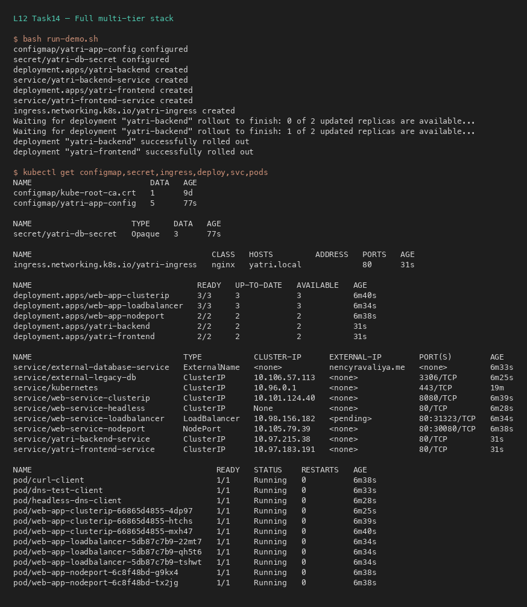

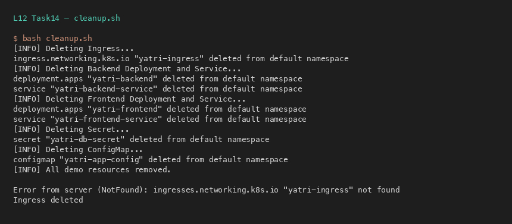

---

## Quick Map: ConfigMap vs Secret vs Ingress

| Object | Purpose | Example |
|---|---|---|
| ConfigMap | Non-sensitive settings | `LOG_LEVEL=INFO` |
| Secret | Credentials (base64) | `POSTGRES_PASSWORD` |
| Ingress | Layer-7 HTTP routing | `/api` → backend Service |
