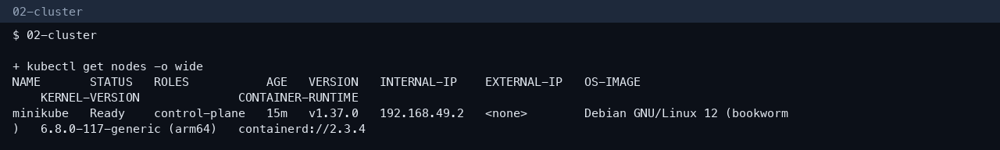
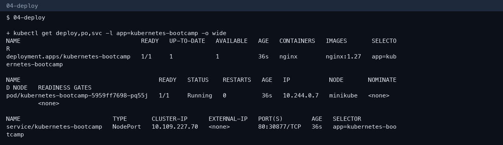
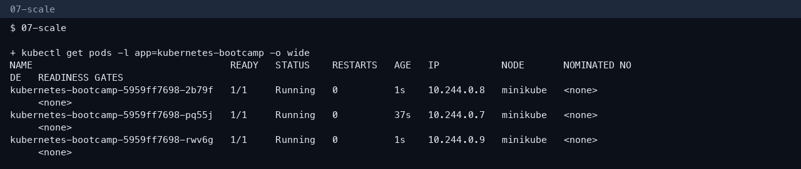
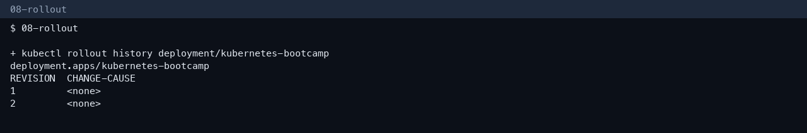
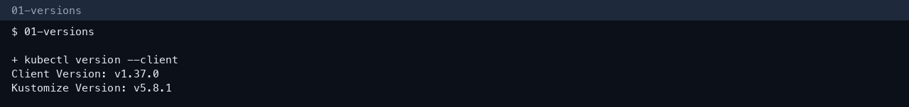
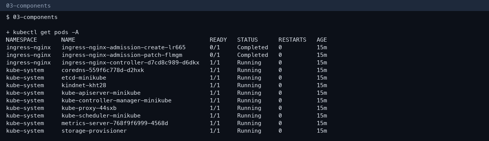
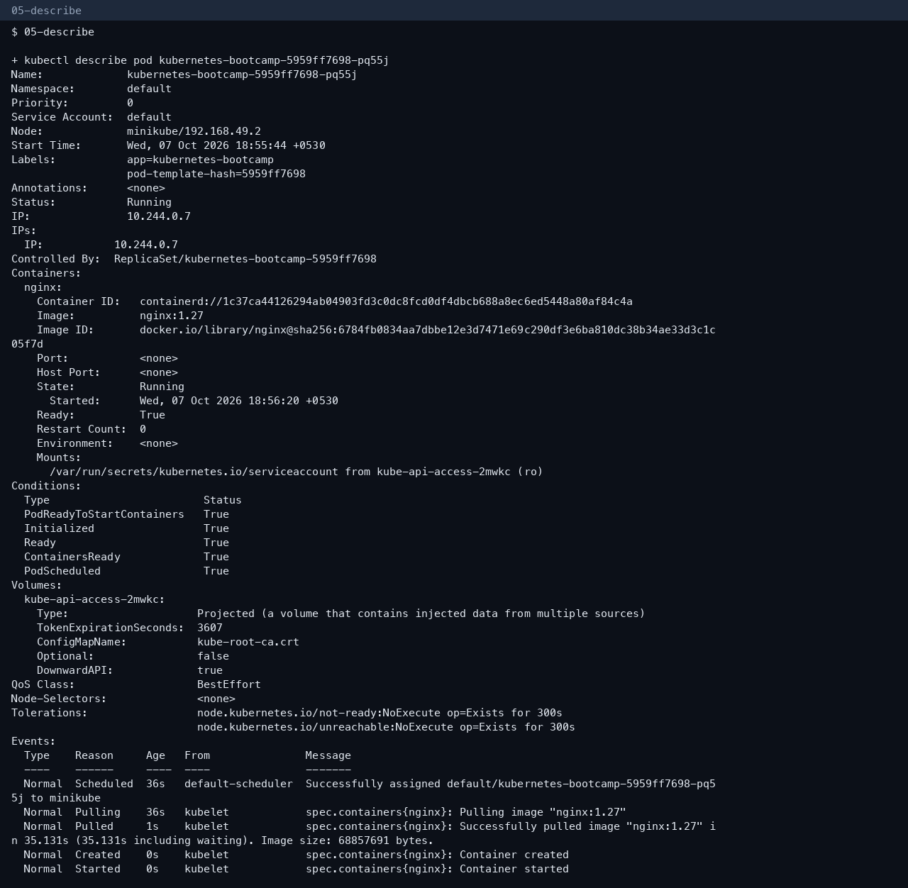
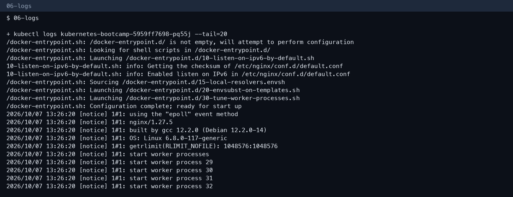
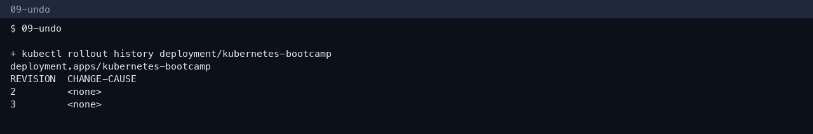

# Session 9 — Kubernetes basics tutorial

**Author:** Kushal S  
**Enrollment:** 24bcs10355

This completes the hands-on part of the Kubernetes Basics tutorial on top of the Minikube install notes in `session9-k8s/Readme.md`.

## Commands

```bash
minikube start --driver=docker --memory=3072 --cpus=2
kubectl create deployment kubernetes-bootcamp --image=nginx:1.27
kubectl expose deployment kubernetes-bootcamp --type=NodePort --port=80
kubectl get deploy,po,svc -l app=kubernetes-bootcamp -o wide
kubectl scale deployment kubernetes-bootcamp --replicas=3
kubectl set image deployment/kubernetes-bootcamp nginx=nginx:1.27-alpine
kubectl rollout undo deployment/kubernetes-bootcamp
```

The tutorial’s original `kubernetes-bootcamp` image is no longer published. `nginx:1.27` is the workload. The objects are still a Deployment, Pods, and a Service.

## What happened

The Deployment became 1/1 Ready, the Service got a NodePort, and scale created three Pods (`10.244.0.7`, `.8`, `.9`). Rollout history then showed the image update and the undo.









## Architecture

Control plane: API server, etcd, scheduler, controller manager.  
Worker: kubelet, kube-proxy, containerd, Pods.  
A `kubectl apply` is stored in etcd, scheduled onto a node, and started by the kubelet. Controllers keep repairing drift.

Full notes: `session9-k8s/Readme.md`.

## More screenshots











