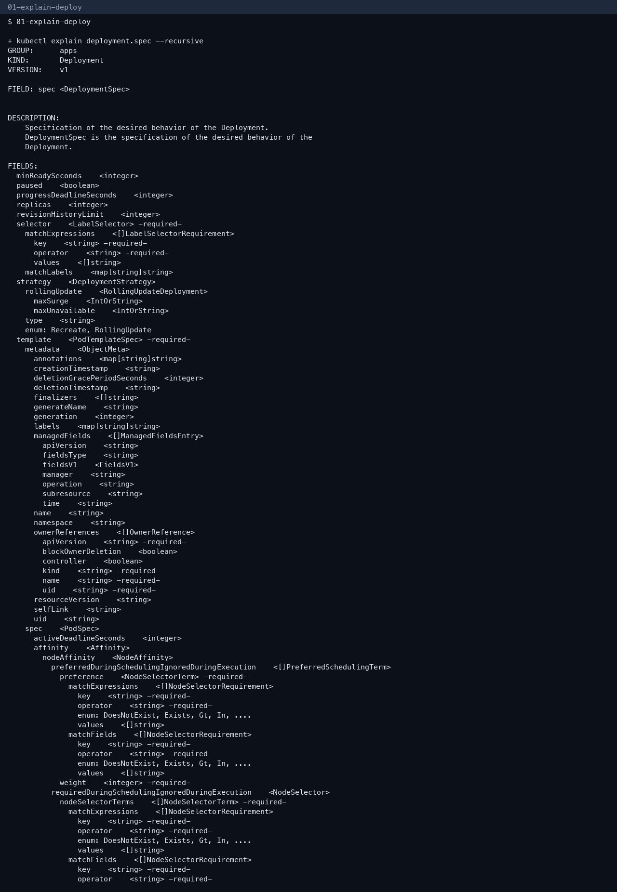
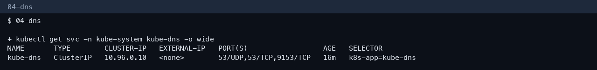
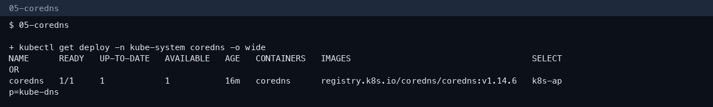
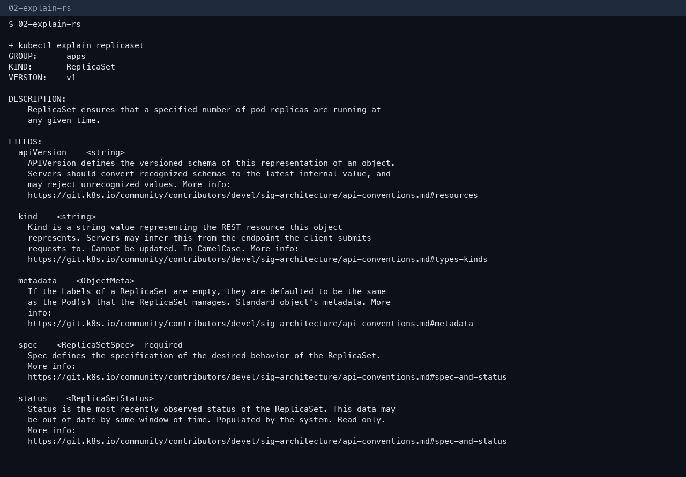
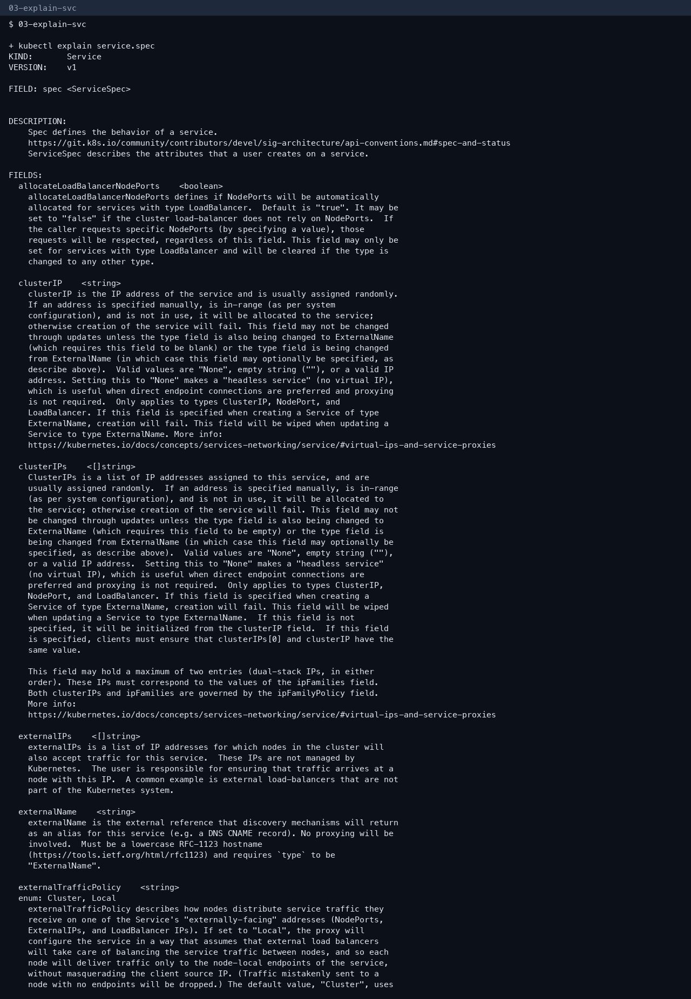

# Session 11 — comparisons, FQDN, and CoreDNS

The five Service types, YAML, and screenshots are in `DevOpsHomework-2/lecture-11/README.md`.

These files are the pieces that assignment asked for as their own documents:

- `DevOpsHomework-2/lecture-11/comparisons/README.md` — Deployment vs ReplicaSet, Deployment vs DaemonSet vs StatefulSet, ReplicaSet vs Service
- `DevOpsHomework-2/lecture-11/fqdn/README.md`
- `DevOpsHomework-2/lecture-11/coredns/README.md`

`kubectl explain` on this cluster:

## More screenshots

