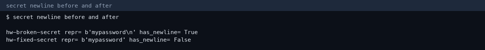
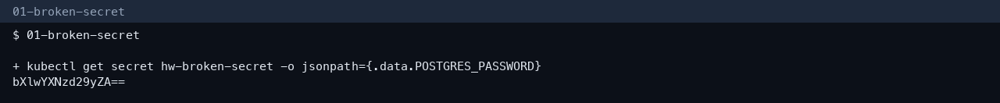
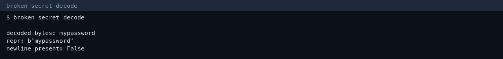
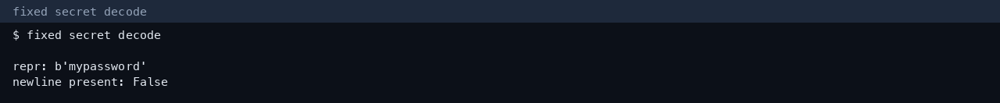

# Session 12 — Secret troubleshooting

ConfigMap, Secret injection, and Ingress screenshots are in `DevOpsHomework-2/lecture-12/README.md`.

## Trailing newline

Course note: `session-12-ingress-configmaps-secrets/troubleshooting/secret-base64-gotcha.md`.

| Secret | base64 | Decoded |
|---|---|---|
| `hw-broken-secret` | `bXlwYXNzd29yZAo=` | `mypassword` plus a newline |
| `hw-fixed-secret` | `bXlwYXNzd29yZA==` | `mypassword` |

The newline is why a database can reject a password that “looks” correct in the YAML. Create Secrets with `echo -n` or `kubectl create secret --from-literal`, and do not commit real values.

## More screenshots

