# Session 13 — Storage, HPA, and the mini project

**Author:** Kushal S  
**Enrollment:** 24bcs10355

## Task 1 — Volumes

Documented in [01-kubernetes-volumes/README.md](01-kubernetes-volumes/README.md): emptyDir, hostPath, PersistentVolume, PersistentVolumeClaim, StorageClass, and dynamic provisioning, with the course YAML applied on Minikube.

## Task 2 — HPA

Course files: `session-13-storage-hpa-probes/04-hpa/`. `hpa-demo` (nginx) stayed at 1 replica because nginx uses about 1% of its CPU request, under the 50% target.

A second Deployment, `cpu-demo`, runs a Python loop with a 50m CPU request and an HPA target of 40%. Metrics-server reported **389%** and the HPA scaled **1 → 4** Pods (the max).

```bash
kubectl get hpa
kubectl get pods
kubectl top pods
kubectl describe hpa
```

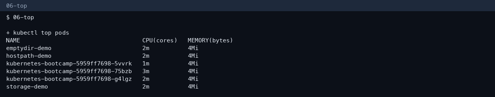

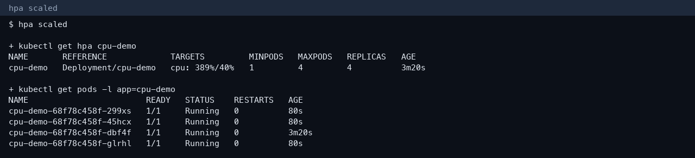

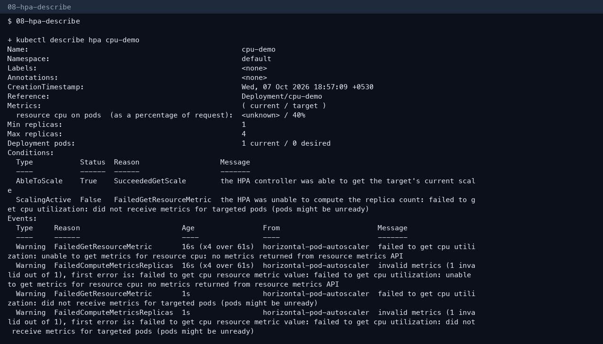

## Task 3 — Mini project

Applied the course mini project into namespace `production-webapp`:

- PVC `web-data` Bound (dynamic 500Mi)
- Deployment `web-app` 2/2 Ready, nginx, startup/readiness/liveness probes, Recreate strategy
- Service `web-service`
- HPA `web-app-hpa` min 2, max 5, CPU target 50%

The HPA target showed `<unknown>` for the first minute, which is metrics-server lag, not a failed Deployment. The Pods were Ready.

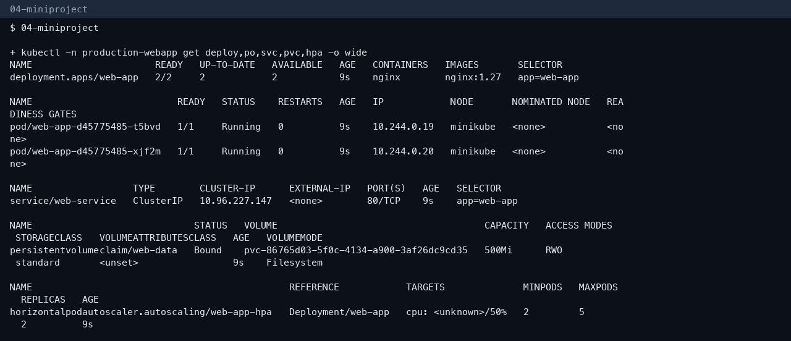

## More screenshots

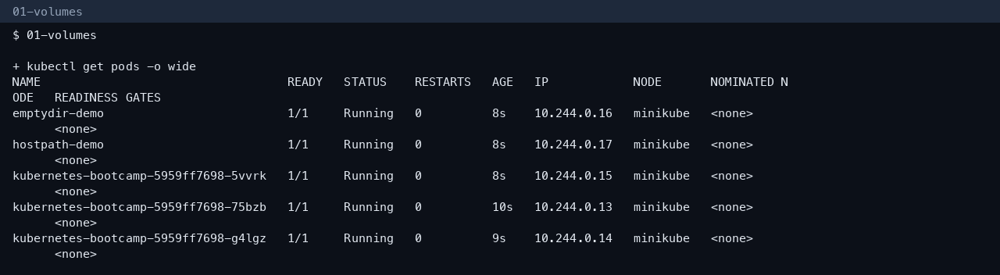

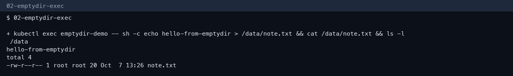

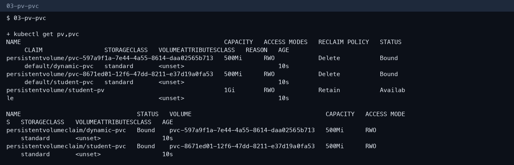

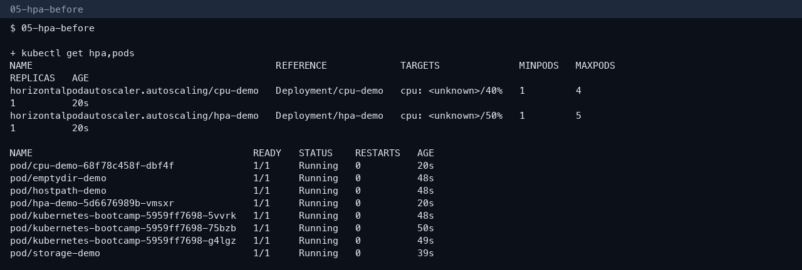

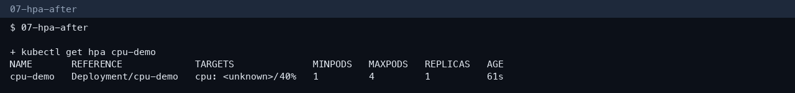

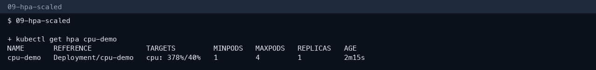

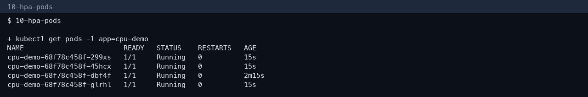

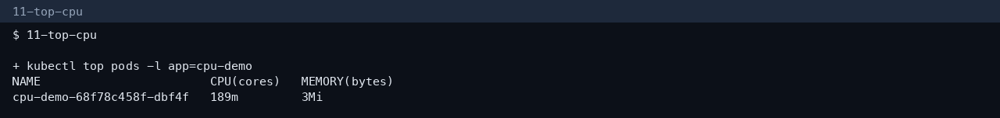

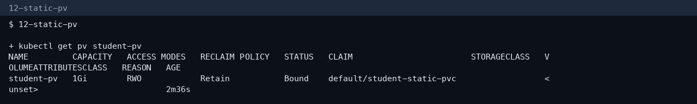

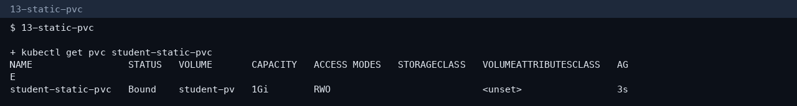

