# Session 14 — Kubernetes troubleshooting

**Author:** Kushal S  
**Enrollment:** 24bcs10355

## Task 1 — Commands

Used on this cluster: `kubectl get`, `kubectl get -o wide`, `kubectl describe`, `kubectl logs`, `kubectl exec` (the DNS check), `kubectl explain pod.spec.containers`, `kubectl get events`, and `kubectl top`.

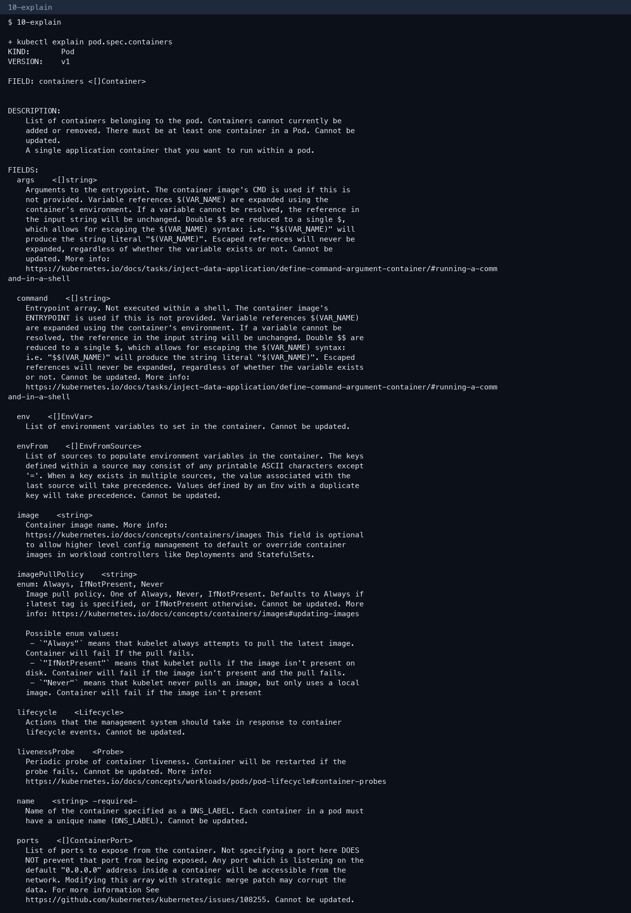

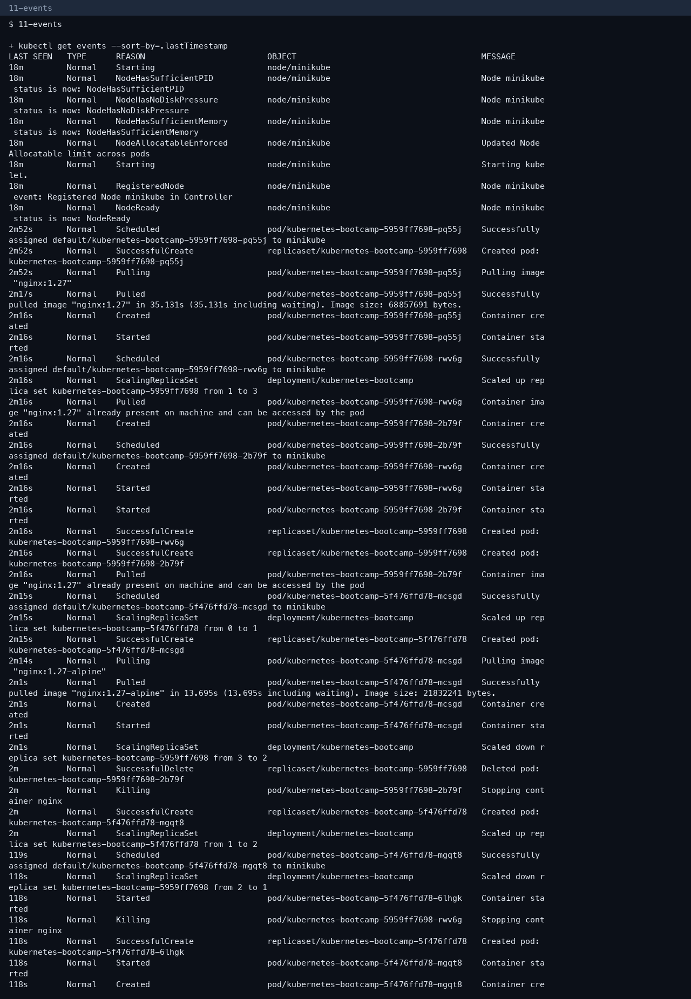

## Task 2 — Issues

| Issue | What we saw | Root cause | Fix | Check |
|---|---|---|---|---|
| CrashLoopBackOff | Pod `fail-1-crashloop-pod` exits | App exits 1 when `DATABASE_URL` is missing. Logs: `DATABASE_URL environment variable is MISSING` | Recreate the Pod with `DATABASE_URL=postgres://lab` | Pod `1/1 Running` |
| ErrImagePull / ImagePullBackOff | `fail-2-imagepull-pod` | Image `yatri-api-service:v999-invalid-tag-does-not-exist` does not exist | Use a real image tag | `describe` Events show the pull error |
| Pending | `pending-demo` | `nodeSelector: disk=does-not-exist` matches no node | Delete the selector or label a node | Pod left Pending until deleted |
| CreateContainerConfigError | `config-demo` | `envFrom` referenced ConfigMap `missing-config` | `kubectl create configmap missing-config` and recreate the Pod | Pod starts |
| Service has no endpoints | `troubleshooting-service` | Selector patched to `app=does-not-match` | Restore selector `app=troubleshooting-app` | Endpoints `<none>` then `10.244.0.26:80,10.244.0.27:80` |
| DNS | `nslookup kubernetes.default.svc.cluster.local` from `dns-check` | CoreDNS is healthy in this run | If it failed: check CoreDNS Pods and NetworkPolicy | Lookup in the DNS screenshot |

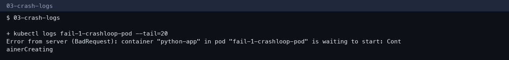

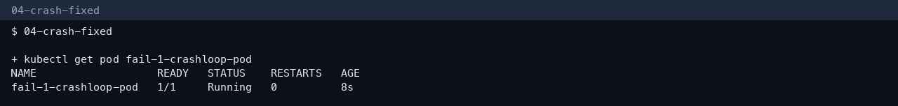

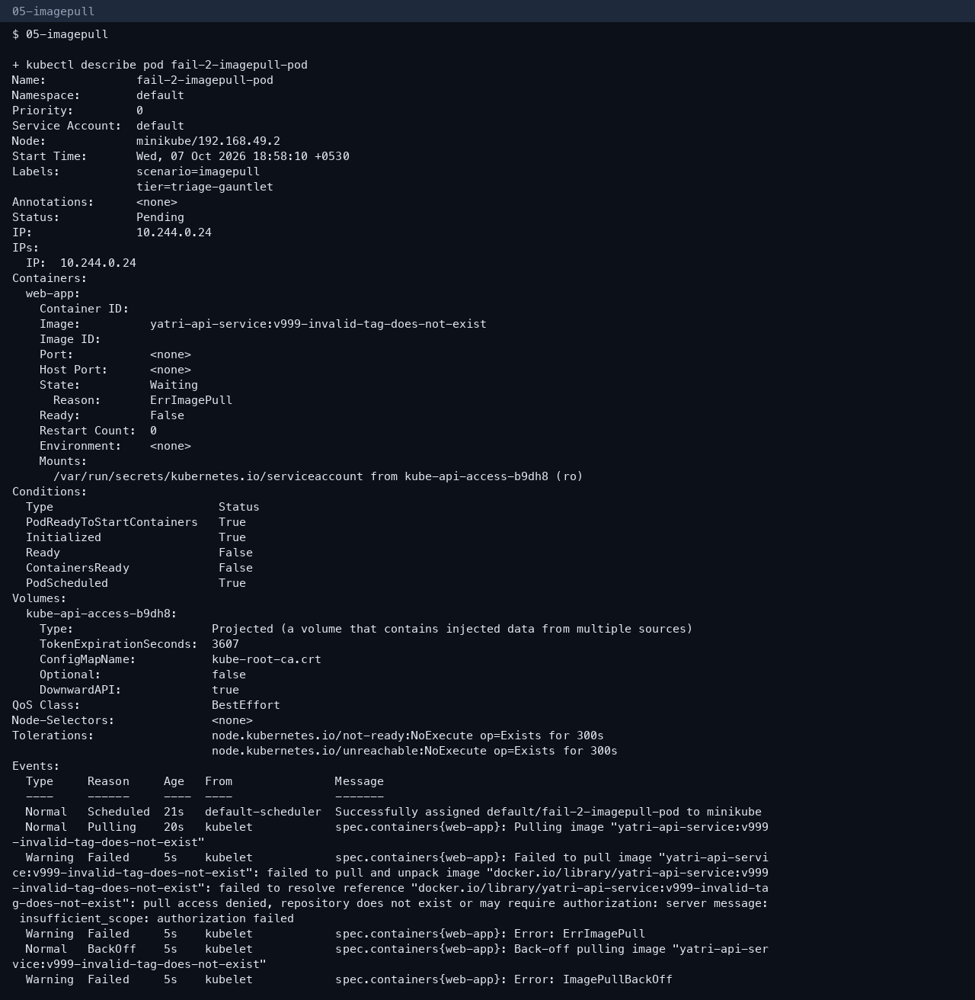

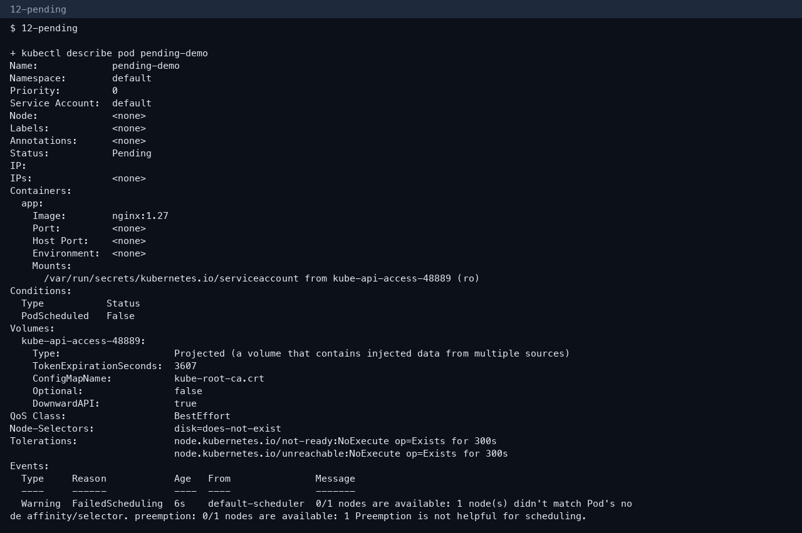

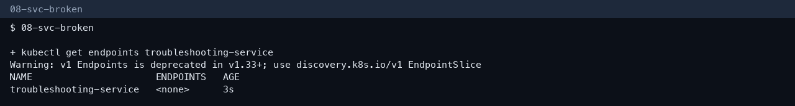

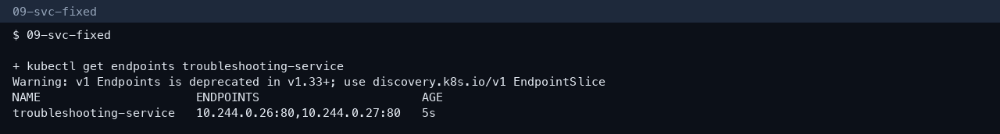

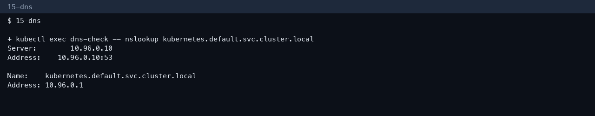

ContainerCreating was the status of the crash and image pods while the image layers were still downloading. After the pull, they moved to CrashLoop and ErrImagePull. That is the difference: ContainerCreating means the kubelet is still setting the container up; CrashLoop means it started and then exited.

## Task 3 — Mini project

Applied `session-14-kubernetes-troubleshooting/mini-project/`:

- `troubleshooting-app` Deployment, 2 nginx Pods
- Service endpoints populated
- `project-broken-pod` uses `nginx:this-tag-does-not-exist`

**Answers**

1. Status: ErrImagePull / ImagePullBackOff.
2. The registry has no manifest for that tag.
3. `kubectl describe pod project-broken-pod` (Events).
4. The image tag is invented.
5. Change the image to `nginx:1.27` and reapply.

The selector break and restore is the service half of the mini project.

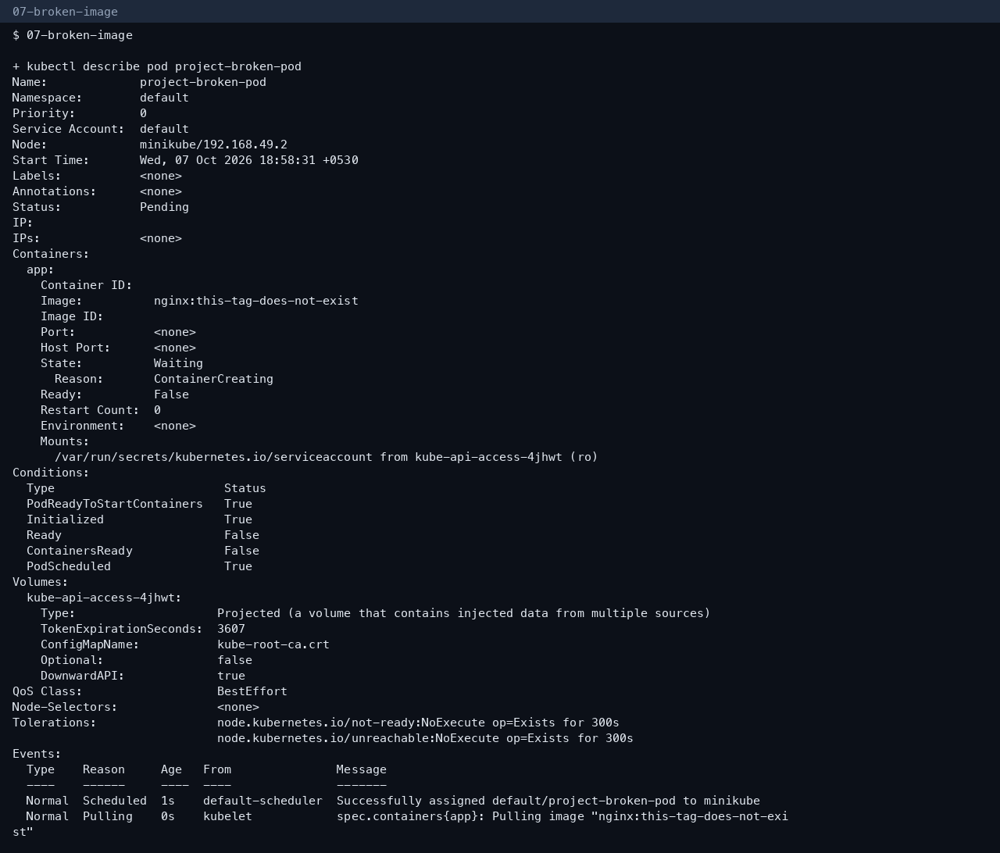

## More screenshots

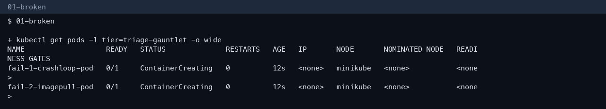

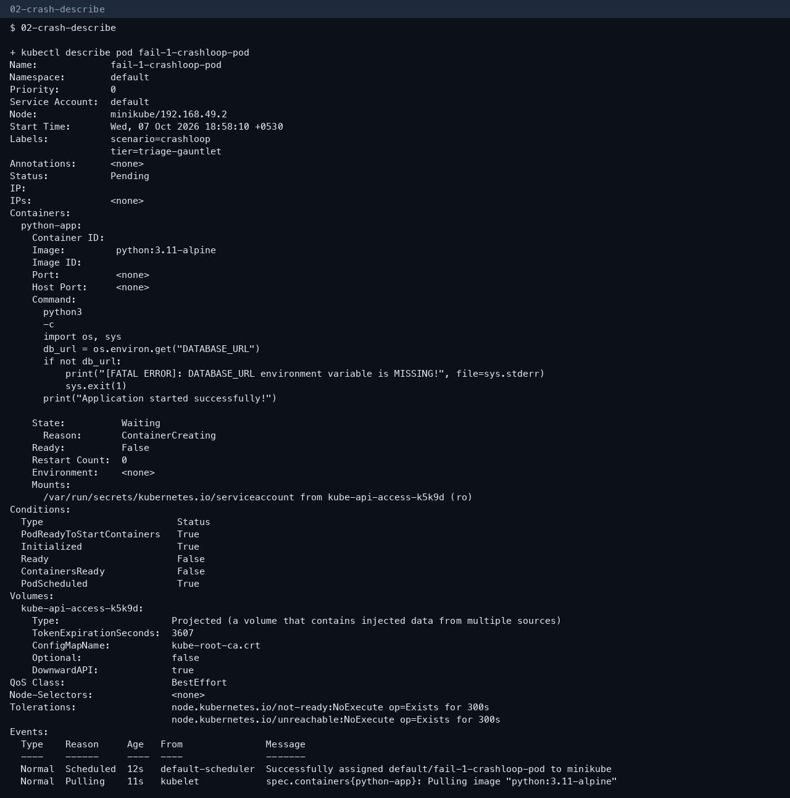

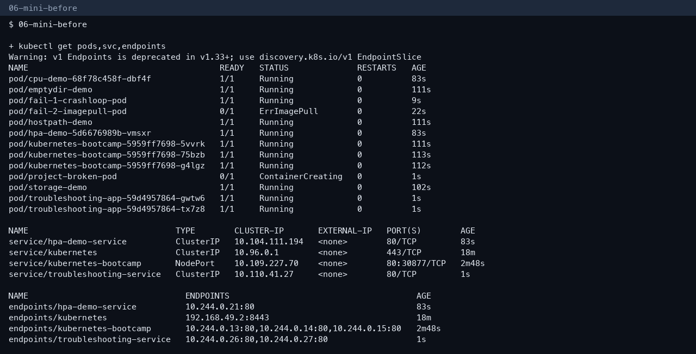

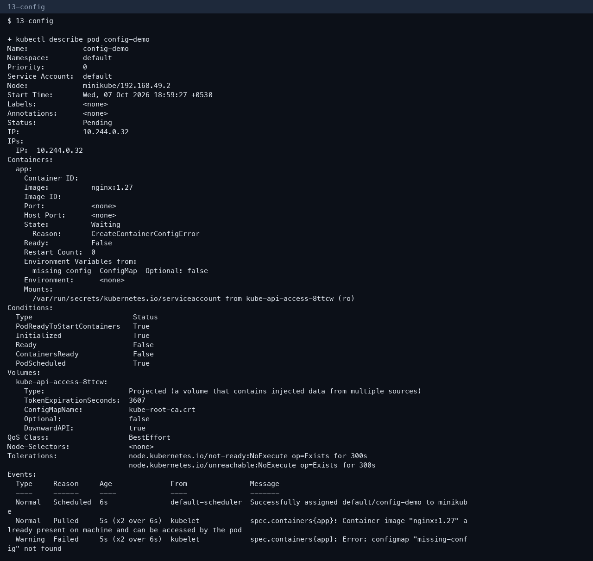

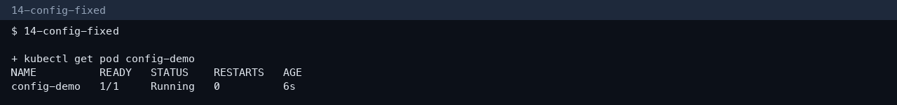

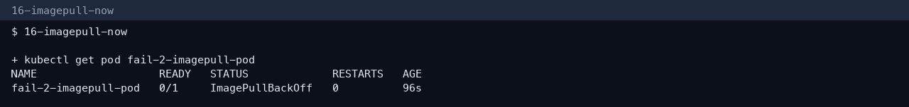

