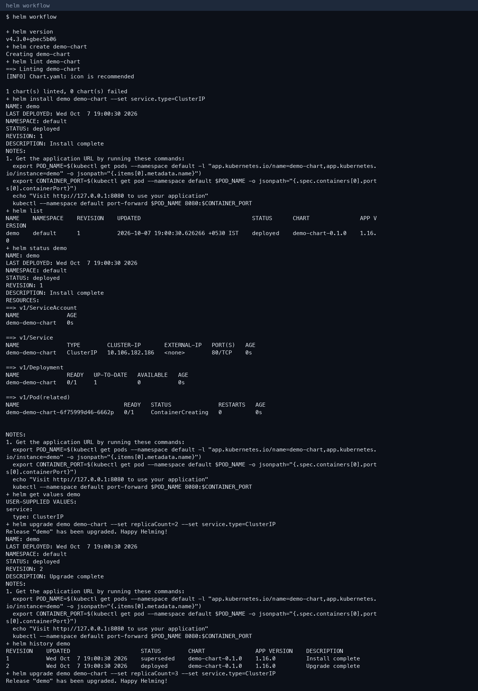
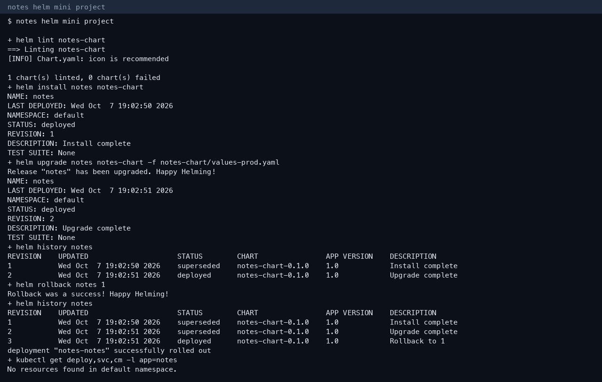
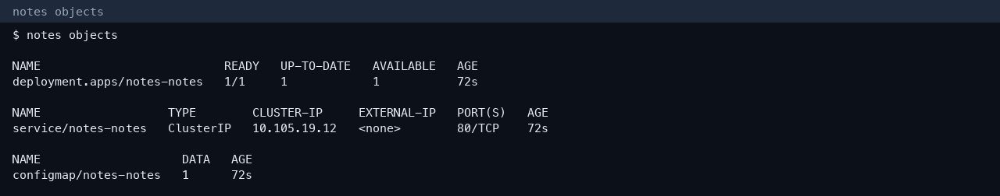

# Session 15 — Helm

**Author:** Kushal S  
**Enrollment:** 24bcs10355  
**Helm:** v4.3.0

## Task 1 — Commands

| Command | What it did |
|---|---|
| `helm create demo-chart` | Scaffolded Chart.yaml, values.yaml, and templates |
| `helm install demo demo-chart` | Revision 1, install complete |
| `helm list` / `helm status` / `helm get values` | Showed the release |
| `helm upgrade` replicaCount 2, then 3 | Revisions 2 and 3 |
| `helm history` | Listed every revision |
| `helm rollback demo 1` | Revision 4, “Rollback to 1” |
| `helm uninstall demo` | Removed the release |
| `helm repo add bitnami` / `helm repo update` / `helm search repo nginx` | Found `bitnami/nginx` 25.2.1 |



The generated chart is `demo-chart/`.

## Task 2 — Rollback workflow

```text
install → upgrade → verify → upgrade again → verify → rollback → verify
```

`helm history` after rollback shows revision 4 as deployed and revisions 1–3 superseded. That is the workflow on `demo` and again on the notes chart.

## Task 3 — Mini project

Chart: `notes-chart/`

```text
notes-chart/
  Chart.yaml
  values.yaml
  values-prod.yaml
  templates/deployment.yaml
  templates/service.yaml
  templates/configmap.yaml
```

```bash
helm lint notes-chart
helm install notes notes-chart
helm upgrade notes notes-chart -f notes-chart/values-prod.yaml
helm rollback notes 1
```

`deployment "notes-notes" successfully rolled out`. History ends at revision 3, “Rollback to 1”.



## More screenshots



