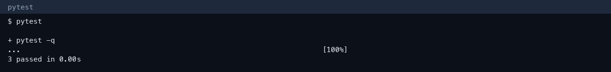
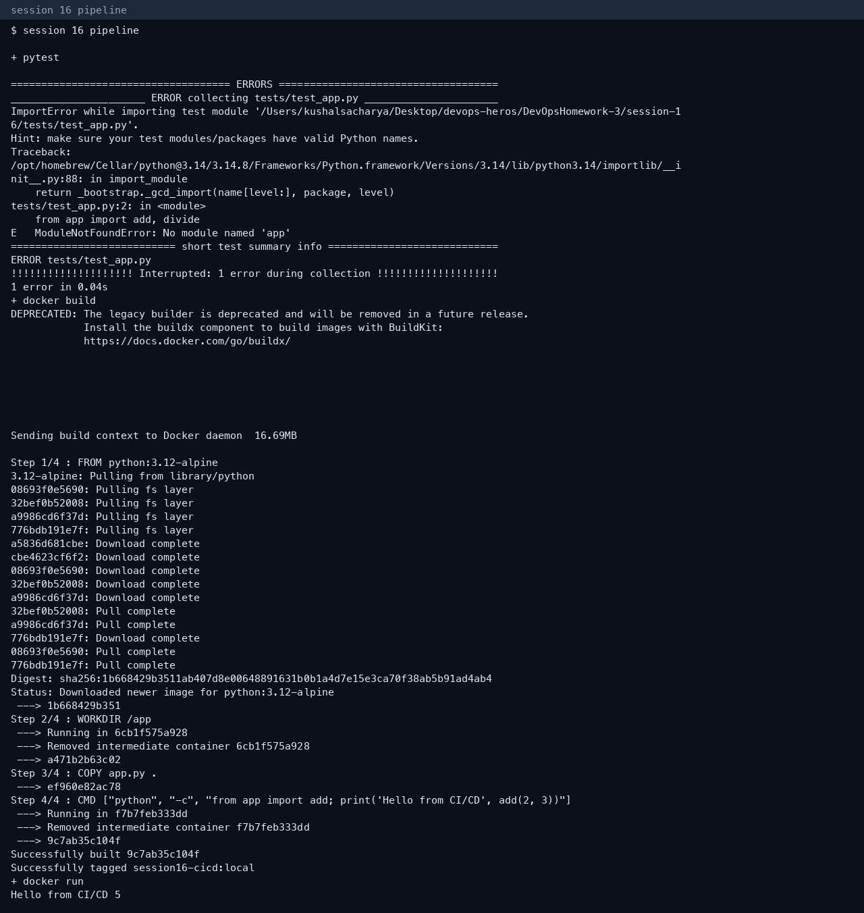

# Session 16 — CI/CD demo

**Author:** Kushal S  
**Enrollment:** 24bcs10355

Reference layout: `session-16-github-actions/session-16-github-actions/10-final-cicd-pipeline`. This folder is the runnable demo.

## What is covered

| Idea | Where |
|---|---|
| CI vs CD | CI is `test` (pytest). CD is `build` (image) and it only runs after tests pass (`needs: test`) |
| Pipeline | `.github/workflows/ci-cd.yml` |
| Workflow, jobs, steps | One workflow, jobs `test` and `build`, steps checkout / setup-python / pytest / docker build / upload-artifact |
| Runner | `ubuntu-latest` |
| Artifact | The Dockerfile is uploaded with `actions/upload-artifact` |
| Build and test | Local pytest and `docker build` / `docker run` |

Secrets are not stored in the repo. A real registry push would use a GitHub Actions secret such as `GITHUB_TOKEN` for GHCR, the same pattern as the course `07-secrets` labs.

## Local run

```text
pytest -q
3 passed in 0.00s

docker build -t session16-cicd:local .
docker run --rm session16-cicd:local
Hello from CI/CD 5
```





The workflow runs on GitHub when this folder is pushed. The commands above are the same steps, executed locally.
