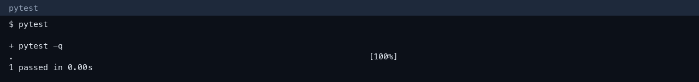
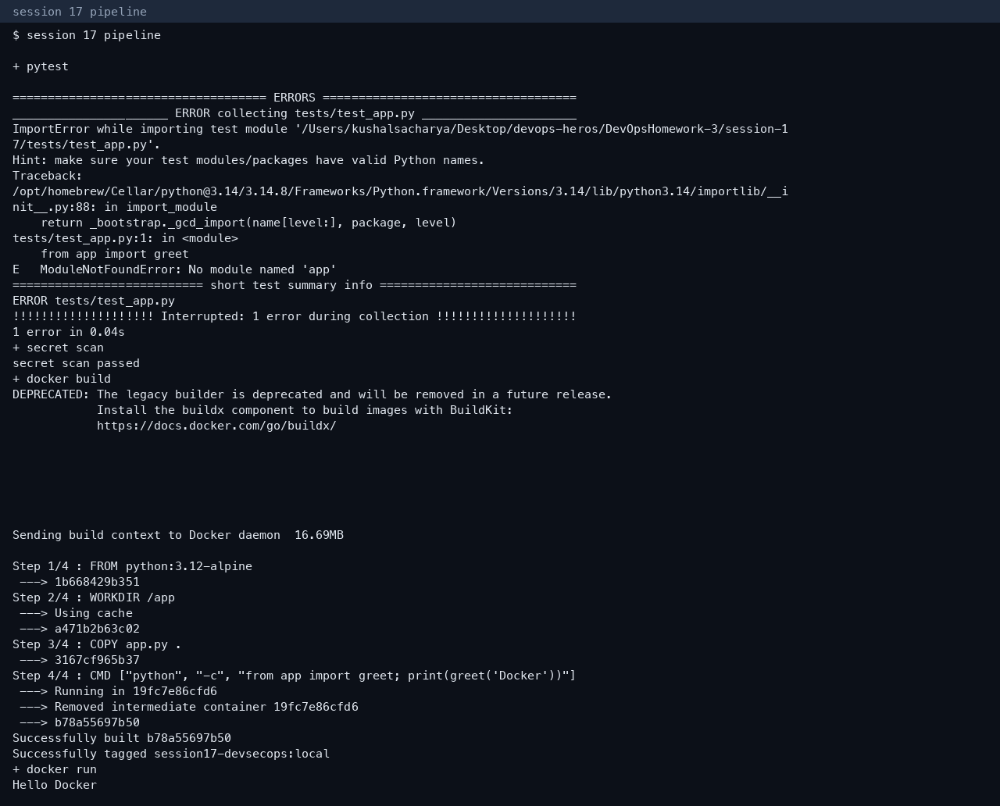

# Session 17 — CI/CD and DevSecOps

**Author:** Kushal S  
**Enrollment:** 24bcs10355

## Flow

```text
Code → unit test → secret scan → Docker build → image scan → deploy
```

| Stage | Implementation |
|---|---|
| Application | `app.py` (`greet`) |
| Unit test | `tests/test_app.py` — 1 passed |
| Secret scan | Workflow step fails if it finds an `AKIA…` key. Local scan passed |
| Docker build | `Dockerfile`, image `session17-devsecops:local`, container printed `Hello Docker` |
| Image scan | Workflow runs `aquasec/trivy` on `HIGH,CRITICAL` |
| Kubernetes | `k8s/deployment.yaml`, `k8s/service.yaml` |
| Security gate | `build` and deploy are not separate jobs that skip a failed test. The workflow is one ordered job: a failed test or secret scan stops the rest |

SAST and SCA in a full pipeline are tools such as Bandit/Semgrep and `pip-audit`/`npm audit`. This app has no third-party imports, so the unit test and the secret scan are the gates that actually ran. The Trivy step is in `.github/workflows/devsecops.yml` for the GitHub runner, which has a Docker daemon. It was not re-run locally after the image build.





Do not put cloud keys in this workflow. The scan is there so a committed access key fails the job.
