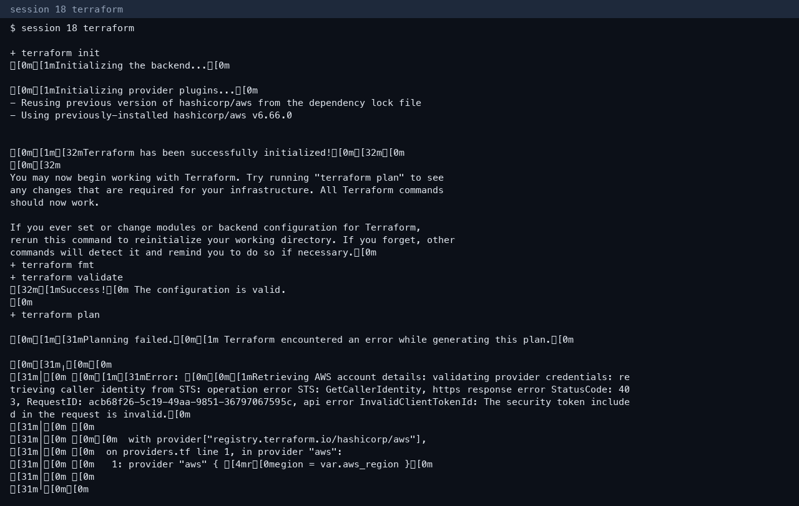

# Session 18 — Terraform S3 and AWS services

**Author:** Kushal S  
**Enrollment:** 24bcs10355

## Task 1 — S3 project

Project: `session18-terraform-iac/terraform-s3-demo/`

```text
main.tf
variables.tf
outputs.tf
providers.tf
terraform.tfvars   (gitignored)
README.md
```

The bucket resource is `aws_s3_bucket.devops553` with `force_destroy = true`, region `ap-northeast-2`.

### Workflow run on 7 Oct 2026

| Command | Result |
|---|---|
| `terraform init` | Success. AWS provider v6.66.0 already installed |
| `terraform fmt` | No files to change |
| `terraform validate` | Success |
| `terraform plan` | Failed: `InvalidClientTokenId` |
| `terraform apply` / `show` / `output` / `destroy` | Not run. Plan could not call STS |

The class access key that worked on 3 Oct 2026 is no longer accepted by AWS. Nothing was created today, and there is no state to destroy.



On 3 Oct the same provider credentials could call STS. S3 `CreateBucket` was denied for this IAM user (`devops-section-a`), so an apply would not have produced a bucket even with a valid key. The VPC lab in session 19 did create resources that day and those were deleted.

## Task 2 — AWS service notes

| Service | README |
|---|---|
| IAM | `session18-terraform-iac/aws-services/01-iam/README.md` |
| EC2 | `session18-terraform-iac/aws-services/02-ec2/README.md` |
| S3 | `session18-terraform-iac/aws-services/03-s3/README.md` |
| VPC | `session18-terraform-iac/aws-services/04-vpc/README.md` |
| DynamoDB and RDS | `session18-terraform-iac/aws-services/05-dynamodb-rds/README.md` |

Longer walkthrough: `session18-terraform-iac/Assignment_Readme.md`.
