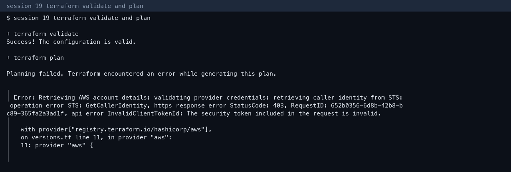

# Session 19 — Cloud infrastructure with Terraform

**Author:** Kushal S  
**Enrollment:** 24bcs10355  
**Region:** `ap-northeast-2` (Seoul)

## Architecture

```text
Terraform
    |
    ├── VPC 10.20.0.0/16          aws_vpc.main
    |
    ├── Public subnet 10.20.1.0/24  aws_subnet.public
    |
    ├── Internet gateway          aws_internet_gateway.main
    |     └── public route 0.0.0.0/0
    |
    ├── Security group            aws_security_group.web  (TCP 80)
    |
    ├── EC2 t4g.micro             aws_instance.web
    |     └── depends_on the internet gateway
    |
    └── S3                        aws_s3_bucket.lab
```

Files: `versions.tf`, `variables.tf`, `main.tf`, `outputs.tf`.

What the project demonstrates:

| Terraform idea | Where |
|---|---|
| Provider | `provider "aws"` in `versions.tf` |
| Variables | `aws_region`, `project` |
| Resources | VPC, subnet, IGW, route table, association, security group, instance, bucket |
| Outputs | vpc id, subnet id, security group id, instance id, bucket name |
| Dependencies | Subnet and IGW use the VPC id. The instance `depends_on` the IGW. The route uses the gateway id |
| State | Local `terraform.tfstate` after apply. It is gitignored |

## Apply status

`terraform init`, `terraform fmt`, and `terraform validate` succeeded. `terraform plan` stopped because AWS rejected the class access key (`InvalidClientTokenId`). Apply and destroy did not run.



On 3 Oct 2026 the VPC lab in `session19-cloud-terraform/06-terraform-vpc` was planned (6 resources to add in Seoul) and two `session19-vpc` stacks that had been created were destroyed: `vpc-08a326bb68c82cc0b` and `vpc-06dd90e20035e1c53`, including their subnets, internet gateways, route tables, and security groups.

This project is the end-to-end shape the assignment asks for (VPC, subnet, security group, EC2, S3). Apply it when a valid key is available:

```bash
cd DevOpsHomework-3/session-19
export AWS_ACCESS_KEY_ID=...
export AWS_SECRET_ACCESS_KEY=...
export AWS_DEFAULT_REGION=ap-northeast-2
terraform init
terraform fmt
terraform validate
terraform plan
terraform apply
terraform output
terraform destroy
```

Do not commit `terraform.tfstate` or the key.
