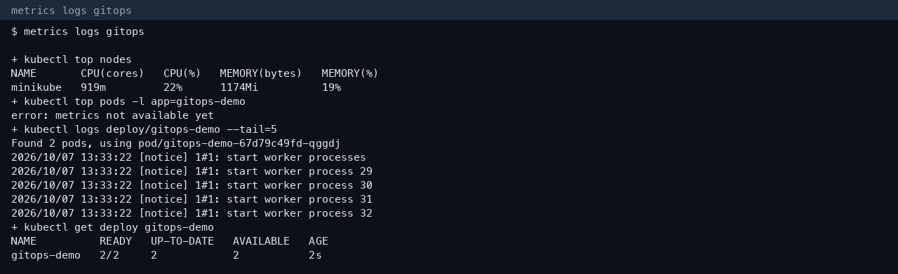
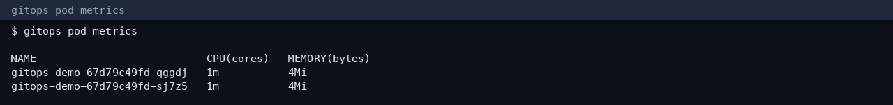

# Session 20 — Monitoring, observability, and GitOps

**Author:** Kushal S  
**Enrollment:** 24bcs10355

## Task 1 — Monitoring

Monitoring is watching known signals and alerting when they cross a line.

| Signal | What it answers | What we ran |
|---|---|---|
| Metrics | How much CPU and memory, and is the count healthy? | `kubectl top nodes` — minikube 919m CPU (22%), 1174Mi memory (19%) |
| Logs | What did the process print? | `kubectl logs deploy/gitops-demo` — nginx worker processes started |
| Alerts | Should a person be paged? | An alert is a rule on a metric. Example: page if Pod CPU stays above 80% of its limit for 5 minutes, or if ready replicas are 0 |
| Application health | Is it serving? | Readiness and liveness probes on the session 13 `web-app` |



## Task 2 — Observability

Observability is being able to explain a new failure from the signals you already collect, not only from dashboards you planned.

| Pillar | Meaning | Kubernetes tools |
|---|---|---|
| Metrics | Numbers over time | metrics-server, Prometheus, `kubectl top` |
| Logs | Discrete events | container stdout, `kubectl logs`, Loki, the node journal |
| Traces | One request’s path across services | OpenTelemetry, Jaeger, Tempo |

You need all three because a CPU graph shows pain, a log shows the error string, and a trace shows which hop added the latency. On Kubernetes the usual set is Prometheus + Grafana for metrics, a log agent such as Fluent Bit, and an OpenTelemetry collector for traces. This Minikube cluster has metrics-server. It does not have a trace backend; a trace would be a span per HTTP hop exported to Jaeger.

## Task 3 — GitOps

GitOps means the Git commit is the desired state. A controller (or a person running `kubectl apply` from that commit) reconciles the cluster until it matches.

| Idea | In this lab |
|---|---|
| Git as source of truth | `gitops/deployment.yaml` |
| Declarative configuration | The file says `replicas: 2`. It does not say “scale up by 1” |
| Reconciliation | `kubectl apply -f gitops/deployment.yaml` twice. First apply created 1 replica. The file was changed to 2 and applied again. The Deployment became 2/2 |
| Kubernetes + GitOps | Argo CD or Flux would watch the Git repo and apply that same file when it changes. The apply here is the same reconciliation step, run by hand |

```text
edit gitops/deployment.yaml
        |
        v
kubectl apply -f gitops/deployment.yaml
        |
        v
Deployment gitops-demo 2/2
```


Course material for Argo CD is in `session20-monitoring-observability-gitops/07-argocd/`.

## More screenshots



