# Session 21 — TaskBoard capstone

**Author:** Kushal S  
**Enrollment:** 24bcs10355  
**App:** `session21-python/`

TaskBoard is a React, FastAPI, and PostgreSQL board. The dashboard is signed in as Kushal S.

## What ran

| Check | Result |
|---|---|
| Pytest | 6 passed (`health`, `ready`, root, create/list/stats, get/update/delete, validation 422) |
| Docker Compose | postgres, backend, frontend all up. UI on http://localhost:3000, API on :8000 |
| Images | Non-root. Frontend is a multi-stage Node build served by nginx on 8080 |
| Helm on Minikube | Release `taskboard` deployed. 2 frontend replicas, 2 backend replicas, Postgres Running |
| Ingress | `taskboard.local`: `/` → frontend, `/api` → backend. Opened through the ingress controller and created a task on that host |
| HPA | `taskboard-backend` min 2 / max 4, target 60% CPU. Live reading was 12%/60% |
| `/metrics` | Prometheus instrumentator on the FastAPI process |
| Terraform | `terraform init` and `terraform validate` succeeded for the VPC + EKS modules in `ap-south-1` |
| Troubleshooting | A missing image ends in `ErrImagePull` / `ImagePullBackOff`. A Service whose selector matches nothing has empty endpoints |

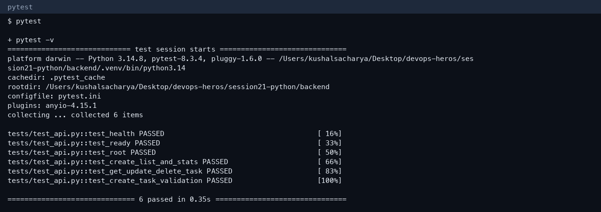

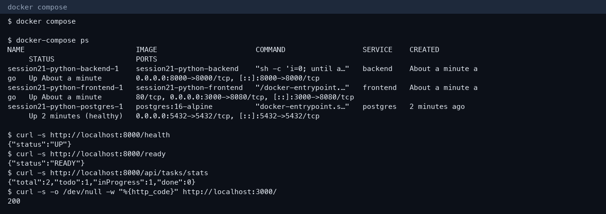

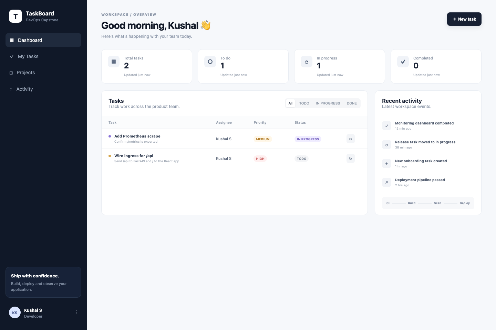

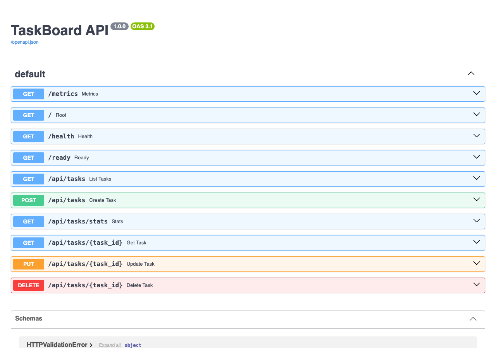

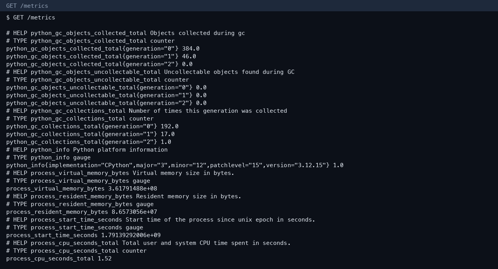

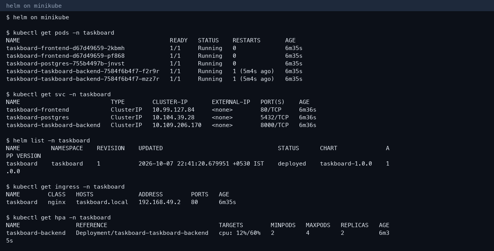

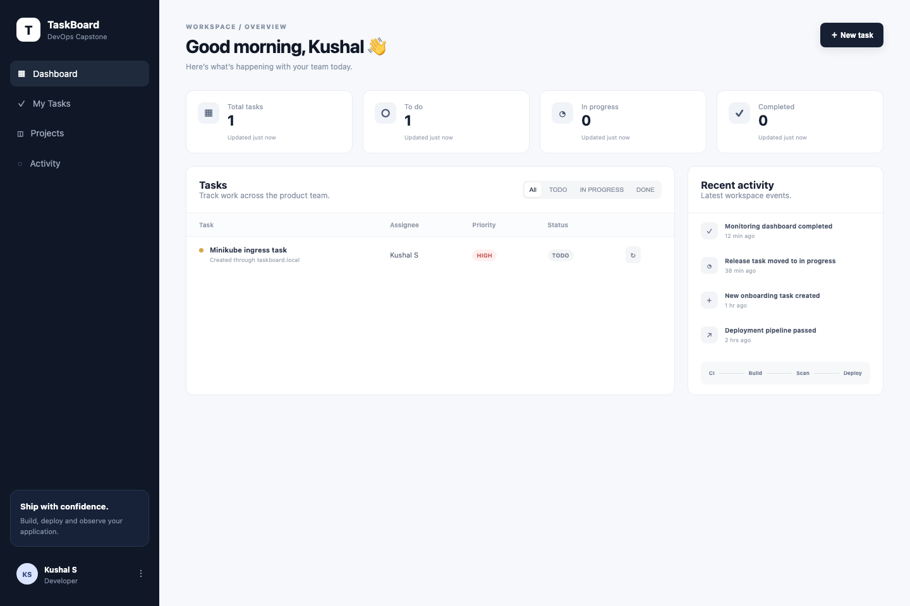

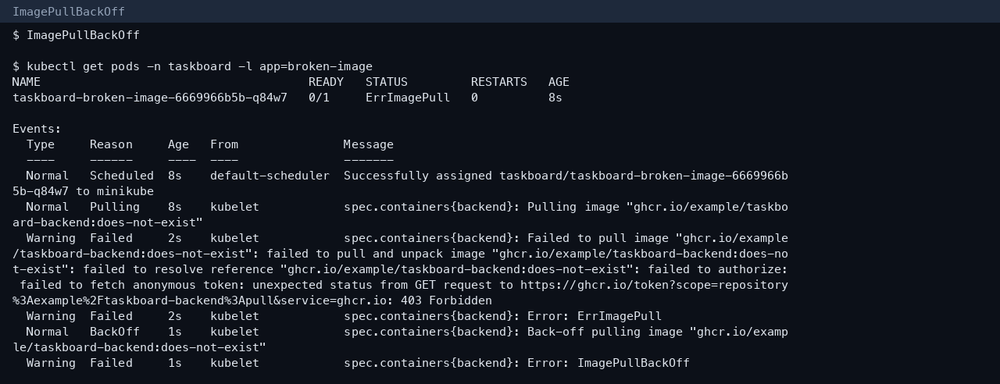

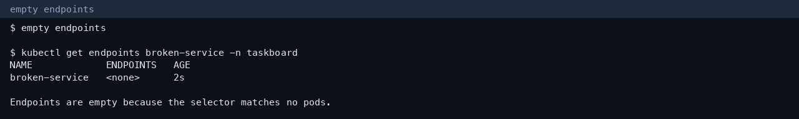

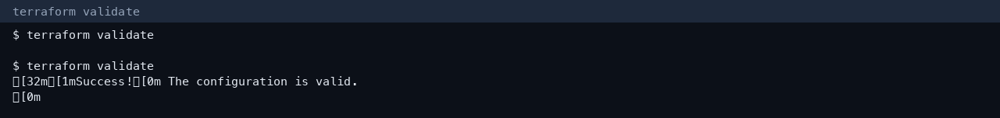

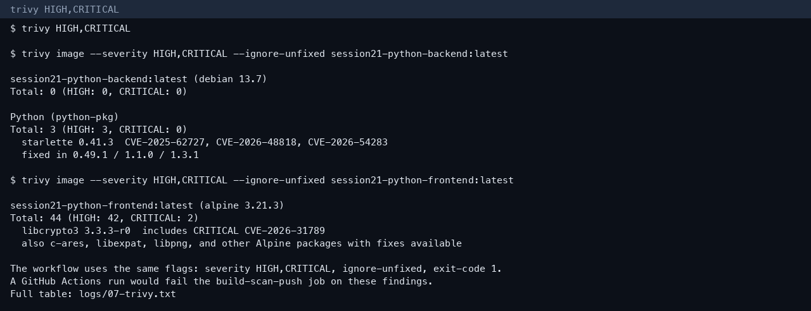

## How it was run

```bash
cd session21-python/backend && .venv/bin/pytest -v
cd session21-python && docker-compose up --build -d
kubectl apply -f session21-python/k8s/namespace.yaml
# images loaded into Minikube as taskboard-frontend:local and taskboard-backend:local
helm upgrade --install taskboard ./helm/taskboard -n taskboard -f ./helm/taskboard/values-minikube.yaml
kubectl port-forward -n ingress-nginx svc/ingress-nginx-controller 18081:80
curl -H 'Host: taskboard.local' http://127.0.0.1:18081/api/tasks
```

Compose waits until Postgres is healthy, then the backend retries `alembic upgrade head` before uvicorn. Nginx resolves the `backend` hostname at request time and listens on 8080 as user `nginx`, with the pid file in `/tmp`.

The broken manifests are `session21-python/troubleshooting/broken-image.yaml` and `broken-service.yaml`. Applying the image manifest left the pod in `ErrImagePull`, then `ImagePullBackOff`, because `ghcr.io/example/taskboard-backend:does-not-exist` has no manifest. The Service manifest selected `app: label-that-does-not-exist`, so its endpoints stayed empty. Both objects were deleted after the capture.

## Pipeline, scan, and infrastructure

The workflow in `session21-python/.github/workflows/ci-cd.yml` runs pytest, builds `taskboard-backend` and `taskboard-frontend`, tags both with the commit SHA, scans them with Trivy at HIGH and CRITICAL (`ignore-unfixed`, exit code 1), and pushes those tags to GHCR.

Trivy 0.58.1 scanned the local images with those same flags. The backend Debian layer reported 0 HIGH and 0 CRITICAL. Python packages reported 3 HIGH in `starlette` 0.41.3 (`CVE-2025-62727`, `CVE-2026-48818`, `CVE-2026-54283`), with fixes in 0.49.1, 1.1.0, and 1.3.1. The frontend Alpine 3.21 image reported 42 HIGH and 2 CRITICAL. `libcrypto3` 3.3.3-r0 includes CRITICAL `CVE-2026-31789`. `c-ares`, `libexpat`, and `libpng` are in the same table, each with a fixed package version.

`terraform init` and `terraform validate` succeeded for `session21-python/terraform`. The configuration is a VPC `10.20.0.0/16` in `ap-south-1` across `ap-south-1a` and `ap-south-1b`, public and private subnets, one NAT gateway, and an EKS 1.31 cluster `taskboard-eks` with a managed node group (`t3.medium`, min 2, max 4, desired 2). `terraform.tfvars.example` sets the region and the cluster name.

`/metrics` on the backend is the Prometheus instrumentator: HTTP request counts and latency for the FastAPI process. The chart’s ServiceMonitor selects `app: taskboard-backend` and scrapes port `http` at `/metrics` every 15 seconds. The HPA on that deployment was holding 2 replicas at 12% of the 60% CPU target.
