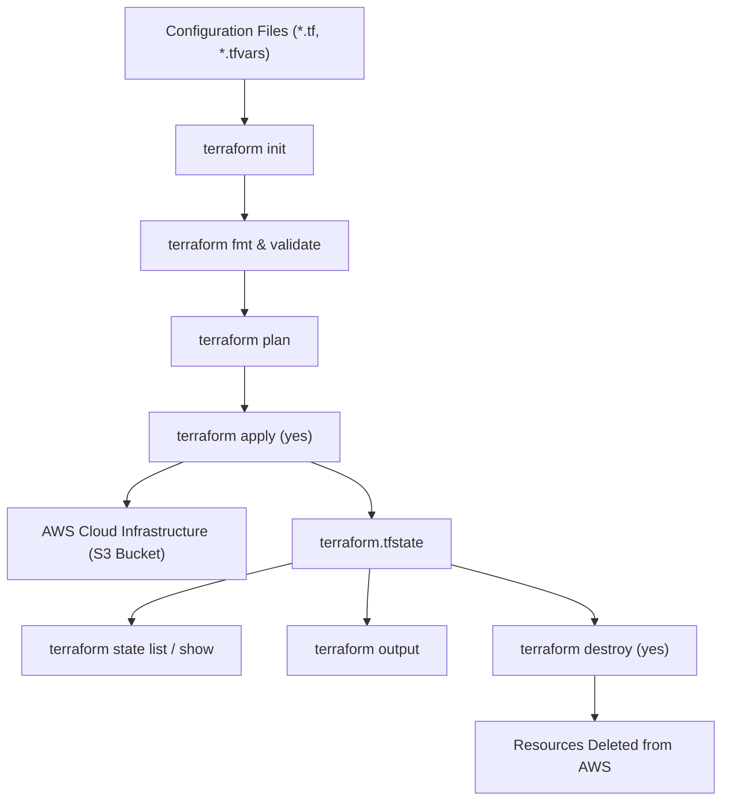

# Session 18: Terraform & Infrastructure as Code (IaC)

## Session Information
- **Session:** Session 18 – Terraform & Infrastructure as Code + AWS Fundamentals
- **Repository:** `devops-heros/session18-terraform-iac`

---

## Table of Contents
1. [Overview & Objectives](#overview--objectives)
2. [Task 1: Terraform S3 Demo (Hands-on IaC Workflow)](#task-1-terraform-s3-demo-hands-on-iac-workflow)
   - [2.1 Project Directory Structure](#21-project-directory-structure)
   - [2.2 Terraform Code Files](#22-terraform-code-files)
   - [2.3 Step-by-Step Hands-on Execution & Screenshots](#23-step-by-step-hands-on-execution--screenshots)
   - [2.4 Terraform Lifecycle Flow & State Management](#24-terraform-lifecycle-flow--state-management)
3. [Task 2: Comprehensive AWS Core Services Research](#task-2-comprehensive-aws-core-services-research)
4. [Deliverables Verification Checklist](#deliverables-verification-checklist)

---

## Overview & Objectives

The primary objectives of this session are:

1. **Infrastructure as Code (IaC) Mastery**: Implement the declarative Terraform workflow (`init` → `fmt` → `validate` → `plan` → `apply` → `show` → `output` → `destroy`) to provision and manage AWS resources safely.
2. **AWS S3 Lifecycle Automation**: Configure modular Terraform manifests (`main.tf`, `variables.tf`, `outputs.tf`, `providers.tf`, `terraform.tf`, `terraform.tfvars`) to manage Amazon S3 buckets.
3. **AWS Foundational Architecture Research**: Conduct an in-depth architectural breakdown of core AWS building blocks: Identity (IAM), Compute (EC2), Object Storage (S3), Virtual Networking (VPC), and Databases (DynamoDB & RDS).

---

## Task 1: Terraform S3 Demo (Hands-on IaC Workflow)

### 2.1 Project Directory Structure

```text
session18-terraform-iac/
├── Assignment_Readme.md
├── Readme.md
├── screenshots/
│   ├── terraform_aws_installation_&_configuration.png
│   ├── terraform_init_fmt_validate.png
│   ├── terraform_plan_1.png
│   ├── terraform_plan_2.png
│   ├── terraform_apply_1.png
│   ├── terraform_apply_2.png
│   ├── terraform_state_list_&_show.png
│   ├── terraform_state_show-2_&_output.png
│   ├── aws_s3_ls.png
│   ├── terraform_plan-destroy_1.png
│   ├── terraform_plan-destroy_2.png
│   ├── terraform_destroy_1.png
│   ├── terraform_destroy_2.png
│   └── terraform_destroy_3.png
├── terraform-s3-demo/
│   ├── main.tf
│   ├── variables.tf
│   ├── outputs.tf
│   ├── providers.tf
│   ├── terraform.tf
│   ├── terraform.tfvars
│   ├── .terraform.lock.hcl
│   └── README.md
└── aws-services/
    ├── 01-iam/README.md
    ├── 02-ec2/README.md
    ├── 03-s3/README.md
    ├── 04-vpc/README.md
    └── 05-dynamodb-rds/README.md
```

---

### 2.2 Terraform Code Files

#### 1. `terraform.tf` (Terraform Settings & Provider Requirements)

```hcl
terraform {
  required_version = ">= 1.6.0"
  required_providers {
    aws = {
      source  = "hashicorp/aws"
      version = "~> 6.0"
    }
  }
}
```

#### 2. `providers.tf` (AWS Provider Configuration)

```hcl
provider "aws" {
  region = var.aws_region
}
```

#### 3. `variables.tf` (Input Variable Declarations)

```hcl
variable "aws_region" {
  type        = string
  description = "AWS region where the S3 bucket will be created."
  default     = "ap-south-1"
}

variable "bucket_name" {
  type        = string
  description = "Name of the S3 bucket."
  default     = "yatri1107"
}
```

#### 4. `terraform.tfvars` (Variable Value Definitions)

```hcl
aws_region  = "ap-south-1"
bucket_name = "yatri1107"
```

#### 5. `main.tf` (AWS S3 Bucket Resource Definition)

```hcl
resource "aws_s3_bucket" "yatri1107" {
  bucket        = var.bucket_name
  force_destroy = true

  tags = {
    Name        = var.bucket_name
    Environment = "dev"
    ManagedBy   = "Terraform"
    Project     = "Session18"
  }
}
```

#### 6. `outputs.tf` (Output Value Exposures)

```hcl
output "bucket_name" {
  type        = string
  description = "Name of the S3 bucket."
  value       = aws_s3_bucket.yatri1107.bucket
}

output "bucket_arn" {
  type        = string
  description = "ARN of the S3 bucket."
  value       = aws_s3_bucket.yatri1107.arn
}

output "bucket_region" {
  type        = string
  description = "AWS region of the S3 bucket."
  value       = aws_s3_bucket.yatri1107.region
}
```

---

### 2.3 Step-by-Step Hands-on Execution & Screenshots

#### Step 1: Environment Verification & AWS CLI Configuration

Before running Terraform, verify CLI binaries and configure AWS credentials.

**Commands:**

```bash
terraform -version
aws --version
aws configure
aws sts get-caller-identity
```

**What to capture:** Terraform version, AWS CLI version, and a successful `get-caller-identity` response showing your IAM identity and account.


> **Note:** `aws sts get-caller-identity` is the best pre-flight check. It confirms valid credentials without creating billable resources.

---

#### Step 2: Initialization, Code Formatting & Validation

```bash
cd session18-terraform-iac/terraform-s3-demo
terraform init
terraform fmt
terraform validate
```

- `terraform init` — downloads the AWS provider and writes `.terraform.lock.hcl`
- `terraform fmt` — formats `.tf` files to HashiCorp style
- `terraform validate` — checks syntax and consistency without calling AWS APIs


---

#### Step 3: Terraform Execution Plan

```bash
terraform plan
```

Compares desired configuration against current state and shows what will change.

Expected summary:

```text
Plan: 1 to add, 0 to change, 0 to destroy.
```


---

#### Step 4: Infrastructure Provisioning (Apply)

```bash
terraform apply
```

Type `yes` when prompted. Terraform calls AWS S3 APIs to create the bucket.

Expected result:

```text
aws_s3_bucket.yatri1107: Creation complete
Apply complete! Resources: 1 added, 0 changed, 0 destroyed.
```


---

#### Step 5: Terraform State Inspection & Outputs

```bash
terraform state list
terraform state show aws_s3_bucket.yatri1107
terraform output
```

- `state list` — resources tracked in `terraform.tfstate`
- `state show` — full attributes for the managed bucket
- `output` — bucket name, ARN, and region from state


> **Important:** Never edit `terraform.tfstate` by hand. Use `terraform state` commands only.

---

#### Step 6: Live Cloud Verification via AWS CLI

```bash
aws s3 ls
```

Confirms the bucket exists in the AWS account (look for `yatri1107`).


---

#### Step 7: Pre-Destruction Planning

```bash
terraform plan -destroy
```

Expected summary:

```text
Plan: 0 to add, 0 to change, 1 to destroy.
```


---

#### Step 8: Infrastructure Teardown & Destruction

```bash
terraform destroy
```

Type `yes` to confirm. Result:

```text
Destroy complete! Resources: 1 destroyed.
```


---

### 2.4 Terraform Lifecycle Flow & State Management



#### What is `terraform.tfstate`?

Terraform stores state about managed infrastructure in `terraform.tfstate`.

- **Purpose:** Maps real cloud resources to configuration, tracks metadata, improves plan performance.
- **Production best practice:** Use a remote backend (S3 + DynamoDB locking). Do not keep production state only on a laptop.

---

## Task 2: Comprehensive AWS Core Services Research

Detailed guides for each core AWS domain live under `aws-services/`:

| Service | Category | Guide | Key Concepts |
| :--- | :--- | :--- | :--- |
| **IAM** | Governance & Identity | [aws-services/01-iam/README.md](./aws-services/01-iam/README.md) | Users, Groups, Roles, Policies, Least Privilege, MFA, STS |
| **EC2** | Elastic Compute | [aws-services/02-ec2/README.md](./aws-services/02-ec2/README.md) | AMIs, Instance Types, Key Pairs, Security Groups, EBS, Lifecycle |
| **S3** | Object Storage | [aws-services/03-s3/README.md](./aws-services/03-s3/README.md) | Buckets, Objects, Storage Classes, Versioning, Lifecycle, Encryption |
| **VPC** | Cloud Networking | [aws-services/04-vpc/README.md](./aws-services/04-vpc/README.md) | CIDR, Subnets, Route Tables, IGW, NAT, NACLs vs SGs |
| **DynamoDB & RDS** | Cloud Databases | [aws-services/05-dynamodb-rds/README.md](./aws-services/05-dynamodb-rds/README.md) | NoSQL vs SQL, Keys, Multi-AZ, Read Replicas, PITR |

---

### 3.1 IAM – Governance & Identity Security

**AWS IAM** controls authentication and authorization across AWS APIs.

```text
                  +--------------------------------+
                  |         IAM Principal          |
                  | (User / Role / Federated / OIDC)|
                  +--------------------------------+
                                  |
                                  v
                  +--------------------------------+
                  |    Policy Evaluation Engine    |
                  |  Explicit Deny > Explicit Allow |
                  +--------------------------------+
                                  |
                   +--------------+--------------+
                   |                             |
                   v                             v
           [ Allow Access ]               [ Deny Access ]
```

- **Users:** Permanent identity for a person or service (password / access keys).
- **Groups:** Collections of users for attaching policies in bulk.
- **Roles:** Temporary credentials via STS (EC2 instance profiles, Lambda, CI/CD OIDC).
- **Policies:** JSON permission documents (`Effect`, `Action`, `Resource`, `Condition`).
- **Least Privilege:** Grant only the minimum permissions required.
- **Best practices:** MFA, rotate keys, prefer roles/groups over user-attached policies, lock down root.

---

### 3.2 EC2 – Elastic Compute Cloud

**Amazon EC2** provides on-demand virtual servers.

- **AMI:** Template for OS + packages (e.g. Ubuntu).
- **Instance types:** General (`t3`), compute (`c6i`), memory (`r6i`), storage (`i3`).
- **Key pairs:** SSH authentication (`chmod 400 key.pem`).
- **Security Groups:** Stateful instance firewall (allow rules only).
- **EBS:** Persistent block storage attached to an AZ.
- **Public vs Private IP:** Public may change on stop/start; private stays with the ENI.
- **Lifecycle:** Pending → Running → Stopping → Stopped → Terminated.

---

### 3.3 S3 – Simple Storage Service

**Amazon S3** is object storage with extremely high durability.

- **Buckets:** Globally unique containers in a region.
- **Objects:** Key + value (+ metadata / version).
- **Storage classes:** Standard, Intelligent-Tiering, IA, Glacier family.
- **Versioning:** Protects against overwrite/delete mistakes.
- **Lifecycle policies:** Auto-transition and expire objects.
- **Encryption:** SSE-S3, SSE-KMS, SSE-C.
- **Bucket policies:** Resource-based access control (HTTPS-only, IP allowlists, etc.).

---

### 3.4 VPC – Virtual Private Cloud Networking

**Amazon VPC** is an isolated virtual network in your account.

```text
+--------------------------------------------------------------------------+
| VPC: 10.0.0.0/16                                                         |
|  +-----------------------------+       +------------------------------+  |
|  | Public Subnet (10.0.1.0/24) |       | Private Subnet (10.0.2.0/24) |  |
|  | [Internet Gateway Route]    |       | [NAT Gateway Route]          |  |
|  |   - ALB / Bastion           |       |   - App Servers / RDS DB     |  |
|  +-----------------------------+       +------------------------------+  |
+--------------------------------------------------------------------------+
```

- **CIDR:** Address range for the VPC.
- **Public subnet:** Route `0.0.0.0/0` via Internet Gateway.
- **Private subnet:** Outbound internet via NAT Gateway; no direct IGW route.
- **Security Group vs NACL:** SG = stateful, instance-level; NACL = stateless, subnet-level.

---

### 3.5 DynamoDB & RDS – Cloud Database Services

```text
+------------------------------------+------------------------------------+
|       Amazon DynamoDB (NoSQL)      |          Amazon RDS (SQL)          |
+------------------------------------+------------------------------------+
| - Key-Value & Document model       | - Relational (MySQL, Postgres, …)  |
| - Schemaless items                 | - Rigid schema & foreign keys      |
| - Horizontal partitioning          | - Vertical scale + Read Replicas   |
| - Single-digit ms at scale         | - JOINs & ACID transactions        |
| - Ideal for locks & sessions       | - Ideal for ERP / e-commerce       |
+------------------------------------+------------------------------------+
```

- **DynamoDB:** Managed NoSQL; partition/sort keys; often used for Terraform state locking.
- **RDS:** Managed SQL engines; Multi-AZ HA; Read Replicas; automated backups / PITR.

---

## Deliverables Verification Checklist

| Requirement | Artifact / Path | Status |
| :--- | :--- | :---: |
| Terraform S3 Project Root | `terraform-s3-demo/` | Ready |
| Terraform Manifests | `main.tf`, `variables.tf`, `outputs.tf`, `providers.tf`, `terraform.tf`, `terraform.tfvars` | Ready |
| Terraform Workflow README | `terraform-s3-demo/README.md` | Ready |
| AWS Setup Screenshot | `screenshots/terraform_aws_installation_&_configuration.png` | Add after run |
| Init / Fmt / Validate Screenshot | `screenshots/terraform_init_fmt_validate.png` | Add after run |
| Plan Screenshots | `screenshots/terraform_plan_*.png` | Add after run |
| Apply Screenshots | `screenshots/terraform_apply_*.png` | Add after run |
| State Screenshots | `screenshots/terraform_state_*.png` | Add after run |
| AWS S3 List Screenshot | `screenshots/aws_s3_ls.png` | Add after run |
| Plan-Destroy Screenshots | `screenshots/terraform_plan-destroy_*.png` | Add after run |
| Destroy Screenshots | `screenshots/terraform_destroy_*.png` | Add after run |
| IAM Research | `aws-services/01-iam/README.md` | Ready |
| EC2 Research | `aws-services/02-ec2/README.md` | Ready |
| S3 Research | `aws-services/03-s3/README.md` | Ready |
| VPC Research | `aws-services/04-vpc/README.md` | Ready |
| DynamoDB & RDS Research | `aws-services/05-dynamodb-rds/README.md` | Ready |
