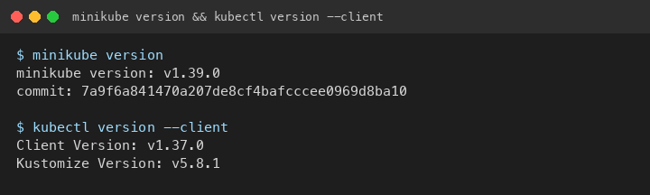
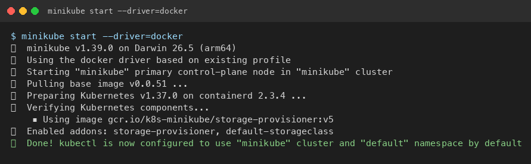
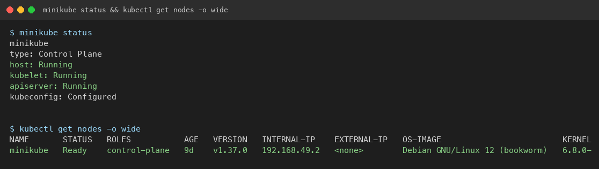
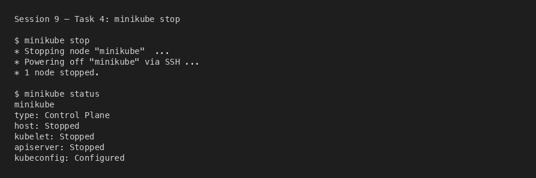

# Session 9: Kubernetes Fundamentals & Cluster Architecture

**Author:** Kushal S  
**Enrollment:** 24bcs10355  
**Course:** SST DevOps & Cloud [SWE]  
**Session:** 09 - Kubernetes Fundamentals  
**Repository:** devops-heros / session9-k8s

---

## Task 1: Minikube & CLI Installation Verification

Verify that Minikube and the Kubernetes CLI (`kubectl`) are successfully installed on the local system.

**Command:**
```bash
minikube version
kubectl version --client
```

**Output:**
```
minikube version: v1.39.0
commit: 7a9f6a841470a207de8cf4bafcccee0969d8ba10

Client Version: v1.37.0
Kustomize Version: v5.8.1
```

**Screenshot:**



---

## Task 2: Starting the Minikube Kubernetes Cluster

Initialize the local single-node Kubernetes cluster using the Docker/Colima runtime.

**Command:**
```bash
colima start
minikube start --driver=docker
```

**Output:**
```
😄  minikube v1.39.0 on Darwin 26.5 (arm64)
✨  Using the docker driver based on existing profile
👍  Starting "minikube" primary control-plane node in "minikube" cluster
🚜  Pulling base image v0.0.51 ...
📦  Preparing Kubernetes v1.37.0 on containerd 2.3.4 ...
🔎  Verifying Kubernetes components...
    ▪ Using image gcr.io/k8s-minikube/storage-provisioner:v5
🌟  Enabled addons: storage-provisioner, default-storageclass
🏄  Done! kubectl is now configured to use "minikube" cluster and "default" namespace by default
```

**Screenshot:**



---

## Task 3: Verifying Cluster Status & Node Health

Inspect the status of the local cluster control plane, kubelet, API server, and verify the node is in `Ready` state.

**Commands:**
```bash
minikube status
kubectl get nodes -o wide
```

**Output:**
```
minikube
type: Control Plane
host: Running
kubelet: Running
apiserver: Running
kubeconfig: Configured

NAME       STATUS   ROLES           AGE   VERSION   INTERNAL-IP    EXTERNAL-IP   OS-IMAGE                         KERNEL-VERSION              CONTAINER-RUNTIME
minikube   Ready    control-plane   9d    v1.37.0   192.168.49.2   <none>        Debian GNU/Linux 12 (bookworm)   6.8.0-117-generic (arm64)   containerd://2.3.4
```

**Screenshot:**



---

## Task 4: Stopping the Minikube Cluster

Gracefully power down the Minikube cluster VM/container to release system resources.

**Command:**
```bash
minikube stop
minikube status
```

**Output:**
```
✋  Stopping node "minikube" ...
🛑  Powering off "minikube" via SSH ...
🛑  1 node stopped.

minikube
type: Control Plane
host: Stopped
kubelet: Stopped
apiserver: Stopped
kubeconfig: Configured
```

**Screenshot:**



> Screenshot captured after all later lecture labs finished, so the cluster stayed available for Sessions 10–12.

---

## Task 5: Kubernetes Cluster Architecture & Component Analysis

Short breakdown of Control Plane vs Worker Node components, based on the [official Kubernetes architecture docs](https://kubernetes.io/docs/concepts/architecture/).

```
+-------------------------------------------------------------------------------+
|                               CONTROL PLANE (MASTER)                          |
|                                                                               |
|   +-------------------+       +--------------------+       +--------------+   |
|   |       etcd        |<----->|  kube-apiserver    |<----->|kube-scheduler|   |
|   | (State Database)  |       |    (Front Door)    |       +--------------+   |
|   +-------------------+       +---------+----------+                          |
|                                         |                                     |
|                                         v                                     |
|                             +------------------------+                        |
|                             | kube-controller-manager|                        |
|                             +------------------------+                        |
+-----------------------------------------+-------------------------------------+
                                          |
                                          v
+------------------------------------+
|          WORKER NODE               |
|   kubelet  |  kube-proxy           |
|   CRI (containerd) -> Pods         |
+------------------------------------+
```

### Control Plane (Master)

- **kube-apiserver** — Single front door. Every `kubectl` call and controller talks to the API server. Only the API server talks to etcd.
- **etcd** — Cluster state database. Desired specs and current status live here.
- **kube-scheduler** — Watches for unscheduled Pods and picks a node using CPU/memory, affinity, taints, and tolerations.
- **kube-controller-manager** — Reconciliation loops. Node controller, ReplicaSet controller, EndpointSlice controller keep current state equal to desired state.

### Worker Node (Data Plane)

- **kubelet** — Node agent. Receives PodSpecs, tells the runtime to start containers, reports health back to the API server.
- **kube-proxy** — Programs iptables/IPVS so Services can load-balance to Pod IPs.
- **CRI / containerd** — Actually runs containers. Modern Kubernetes does not talk to the old Docker daemon directly.
- **Pod** — Smallest deployable unit. One or more containers share network namespace and volumes.

### How they interact

1. You run `kubectl apply`.
2. API server validates and writes the object to etcd.
3. Scheduler assigns a node.
4. Kubelet on that node starts the containers via containerd.
5. Controllers keep watching and repairing drift (restarts, replica counts, endpoints).

---

## Resources

- https://kubernetes.io/docs/tutorials/kubernetes-basics/
- https://minikube.sigs.k8s.io/docs/start/
- https://kubernetes.io/docs/concepts/architecture/
- https://github.com/Nency-Ravaliya/Kubernetes
